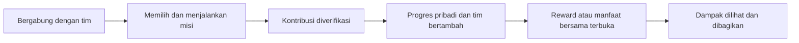
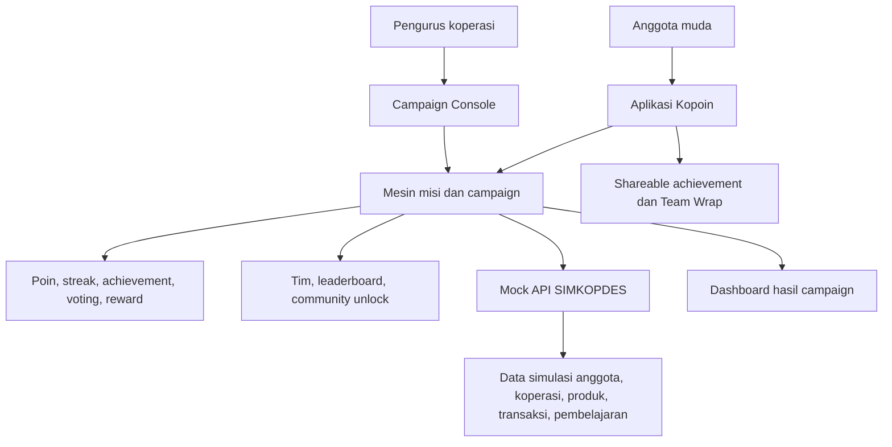

# Kopoin

**Mesin Misi dan Loyalitas Anggota Muda untuk SIMKOPDES**

Kopoin adalah lapisan aktivasi anggota muda untuk koperasi: mengubah misi, transaksi produk lokal, referral aktif, voting, progres tim, dan reward menjadi pengalaman sosial yang mudah dipahami dan layak dibagikan.

Pilar: **Literasi Gen Z & Gen Alpha**  
Tim: **MechaMinds**

## Tentang Kopoin

SIMKOPDES telah menyediakan fondasi digital koperasi, mulai dari keanggotaan, data kelembagaan, pembelajaran, perdagangan, sampai layanan pendukung. Tantangan berikutnya adalah membuat generasi muda tidak hanya terdaftar, tetapi rutin memakai koperasi, mendukung produk lokal, dan merasa menjadi bagian dari komunitasnya.

Kopoin dirancang untuk menjawab sisi aktivasi tersebut. Produk ini membuat kegiatan koperasi terasa lebih dekat dengan kebiasaan Gen Z: ada tim, misi, progres, reward, voting, achievement, dan hasil yang bisa dibagikan.

## Masalah yang Kami Lihat

Digitalisasi koperasi belum otomatis menghasilkan keterlibatan anggota muda. Banyak anak muda sudah terbiasa dengan pengalaman digital yang cepat, sosial, dan memberi progres yang terlihat, sementara koperasi sering masih dipersepsikan sebagai layanan administratif atau tempat transaksi sesekali.

Kesenjangannya bukan hanya pada aplikasi, tetapi pada alasan untuk kembali. Anggota muda perlu melihat manfaat langsung, merasa kontribusinya berarti bagi tim atau desa, dan memiliki ruang untuk ikut menentukan kampanye yang relevan dengan komunitasnya.

## Solusi yang Kami Tawarkan

Kopoin mengubah interaksi koperasi menjadi alur partisipasi berbasis komunitas. Anggota bergabung dalam tim, memilih atau menjalankan misi, memindai QR transaksi atau menyelesaikan aktivitas yang diverifikasi, lalu mendapat Kopoin, streak, achievement, atau reward yang memperkuat progres pribadi dan tim.

Contohnya, Gabriel bergabung dengan Tim Pemuda Sukamaju. Ia membeli produk lokal di Koperasi Merah Putih Sukamaju dan memindai QR transaksi. Gabriel mendapat Kopoin, progres tim bertambah, target produk lokal semakin dekat tercapai, dan seluruh tim berpeluang membuka kupon atau manfaat bersama.

## Cara Kerja



Alur ini menjaga Kopoin tetap sederhana: anggota tahu apa yang perlu dilakukan, koperasi tahu kontribusi apa yang terjadi, dan komunitas melihat progres bersama.

## Fitur Utama MVP

Bagian ini merangkum cakupan MVP berdasarkan blueprint produk. Karena repository saat ini belum berisi source code aplikasi, status implementasi teknisnya belum dapat diverifikasi dari repo.

| Fungsi | Mekanisme | Nilai bagi anggota muda | Status di repo |
| --- | --- | --- | --- |
| Aktivasi anggota | Kartu anggota digital, misi, dan scan QR transaksi | Membuat anggota memahami aksi pertama yang harus dilakukan | Dirancang di blueprint, belum ditemukan implementasi source code |
| Progres personal | Kopoin, kupon, catatan hemat, streak, dan achievement | Memberi manfaat langsung dan alasan untuk kembali | Dirancang di blueprint, belum ditemukan implementasi source code |
| Progres tim | Tim komunitas, leaderboard, dan community unlock | Membuat partisipasi terasa kolektif, bukan sekadar transaksi pribadi | Dirancang di blueprint, belum ditemukan implementasi source code |
| Pertumbuhan komunitas | Referral berbasis anggota aktif | Menghindari akun kosong karena reward muncul setelah pengguna baru benar-benar aktif | Dirancang di blueprint, belum ditemukan implementasi source code |
| Partisipasi | Voting misi, produk, UMKM, atau reward | Memberi ruang bagi anggota muda untuk ikut menentukan arah kampanye | Dirancang di blueprint, belum ditemukan implementasi source code |
| Dampak dan sharing | Impact receipt, shareable achievement, dan Team Wrap | Menunjukkan hubungan antara transaksi, produk lokal, dan progres tim | Dirancang di blueprint, belum ditemukan implementasi source code |
| Operasional campaign | Campaign Console dan dashboard hasil | Membantu koperasi melihat performa kampanye dan perilaku anggota | Dirancang di blueprint, belum ditemukan implementasi source code |

## Mengapa Mekanisme Ini Relevan untuk Gen Z

**Tim dan misi bersama** membangun identitas komunitas. Anggota tidak hanya mengejar poin pribadi, tetapi membantu kelompoknya mencapai target yang terlihat.

**Leaderboard** memberi umpan balik cepat dan kompetisi sehat. Penilaian tidak hanya bertumpu pada nominal belanja, tetapi juga konsistensi, penyelesaian misi, pembelajaran, voting, dan dukungan pada produk lokal.

**Streak** membantu membentuk kebiasaan. Kontribusi mingguan membuat anggota punya alasan untuk kembali memakai layanan koperasi.

**Achievement** mengubah kontribusi menjadi pencapaian yang dapat dikoleksi dan dibagikan. Ini membuat dukungan terhadap koperasi terasa lebih personal dan sosial.

**Voting** memberi rasa berpengaruh. Anggota muda dapat ikut memilih misi, produk yang dipromosikan, UMKM yang didukung, atau reward bersama, tanpa menggantikan proses formal koperasi seperti RAT.

**Reward dan sharing** memberi manfaat yang mudah dipahami. Kopoin, kupon, impact receipt, dan Team Wrap membantu anggota melihat penghematan, progres, serta dampak produk lokal yang mereka dukung.

## Dukungan terhadap SIMKOPDES

Kopoin dirancang sebagai lapisan aktivasi anggota muda yang melengkapi ekosistem SIMKOPDES, bukan menggantikan sistem inti yang sudah ada.

Pada tahap MVP, integrasi SIMKOPDES disimulasikan melalui mock data atau mock API. Arsitektur Kopoin disiapkan agar dapat terhubung dengan data anggota, produk, pembelajaran, dan transaksi ketika akses integrasi resmi tersedia.

| SIMKOPDES | Kopoin |
| --- | --- |
| Identitas dan keanggotaan | Misi dan keterlibatan anggota muda |
| Data koperasi dan produk | Tim, leaderboard, streak, dan achievement |
| Transaksi dan layanan koperasi | Reward, kupon, dan catatan dampak |
| Dashboard kelembagaan | Analitik campaign dan perilaku anggota |
| Pembelajaran | Misi belajar yang terhubung dengan progres |

## Arsitektur atau Alur Sistem



Prinsip kepatuhan dari blueprint: Kopoin tidak menyimpan dana pengguna. Pembayaran dilakukan melalui kanal koperasi atau mitra resmi. Untuk hackathon, integrasi SIMKOPDES ditunjukkan melalui mock API dan data simulasi.

## Teknologi yang Digunakan

Berdasarkan pemeriksaan repository saat README ini dibuat, belum ditemukan source code aplikasi, `package.json`, `requirements.txt`, `docker-compose.yml`, `.env.example`, atau konfigurasi framework lain di root repository.

Teknologi yang dapat disebut secara aman saat ini:

| Area | Status |
| --- | --- |
| Dokumentasi | Markdown melalui `README.md` |
| Integrasi SIMKOPDES | Dirancang sebagai mock API atau mock data pada tahap MVP, sesuai blueprint |
| Frontend, backend, database, dan package manager | Belum terdeteksi di repository |

## Status MVP

| Kategori | Status |
| --- | --- |
| Sudah dibuat di repository | README proyek sebagai dokumentasi utama |
| Masih berupa simulasi atau rancangan blueprint | Core loop tim - misi - verifikasi - progres - reward - share, mock API SIMKOPDES, QR simulasi, leaderboard, voting, kupon, impact receipt, dan Campaign Console |
| Direncanakan tahap berikutnya | Pilot koperasi atau komunitas, integrasi resmi SIMKOPDES, campaign builder lanjutan, analitik perilaku anggota, dan API terkontrol |

## Menjalankan Proyek

Saat ini belum ada aplikasi yang dapat dijalankan dari repository ini karena belum tersedia source code, package manager, atau konfigurasi environment.

Jika source code MVP sudah ditambahkan, bagian ini perlu diperbarui berdasarkan file yang benar-benar tersedia, misalnya:

1. Prasyarat runtime yang digunakan.
2. Cara memasang dependensi sesuai package manager.
3. Konfigurasi `.env` atau koneksi mock API.
4. Perintah menjalankan development server.
5. Perintah build, test, atau lint bila tersedia.

Tidak ada command instalasi atau run yang dicantumkan agar README tidak mengarang teknologi yang belum ada.

## Struktur Repository

Struktur saat ini masih minimal.

```text
.
└── README.md
```

## Demo dan Dokumentasi

- [Demo Aplikasi](TAMBAHKAN_LINK_DEMO)
- [Video Demo](TAMBAHKAN_LINK_VIDEO)
- [Blueprint Produk](TAMBAHKAN_LINK_PDF)

Tambahkan tautan resmi setelah demo, video, dan file blueprint tersedia secara publik.

## Roadmap

| Tahap | Fokus |
| --- | --- |
| MVP hackathon | Membuktikan core loop: tim, misi, QR simulasi, verifikasi, progres, reward, dan share |
| Pilot awal | Menguji satu koperasi atau komunitas muda, satu kampanye produk lokal, dan satu community unlock |
| Integrasi SIMKOPDES | Menghubungkan data anggota, produk, pembelajaran, dan transaksi setelah akses resmi tersedia |
| Campaign dan analitik | Mengembangkan Campaign Console, dashboard perilaku anggota, evaluasi retensi, referral aktif, dan redemption reward |
| Replikasi | Menyiapkan pola campaign yang dapat digunakan ulang oleh koperasi lain dengan tata kelola dan privasi data yang jelas |

## Tim MechaMinds

| Nama | Peran | Profil |
| --- | --- | --- |
| Gabriel Batavia | Ketua Tim | GitHub: `TAMBAHKAN_LINK_GITHUB_GABRIEL` - Foto: `TAMBAHKAN_FOTO_GABRIEL` |
| Rio Valdo | Anggota | GitHub: `TAMBAHKAN_LINK_GITHUB_RIO` - Foto: `TAMBAHKAN_FOTO_RIO` |
| Raul | Anggota | GitHub: `TAMBAHKAN_LINK_GITHUB_RAUL` - Foto: `TAMBAHKAN_FOTO_RAUL` |

## Lisensi

Lisensi belum ditentukan karena file lisensi belum tersedia di repository ini.
