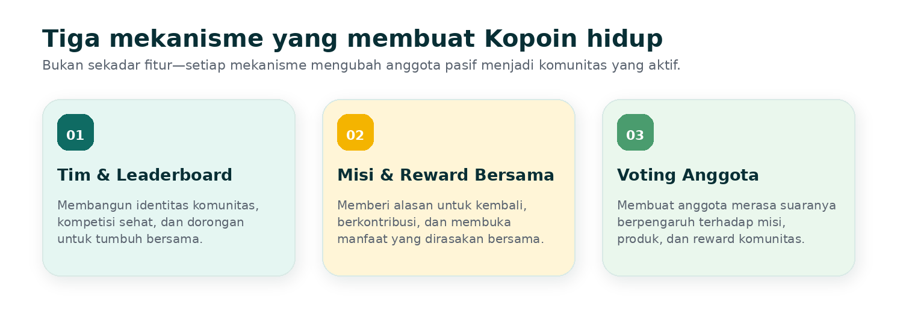
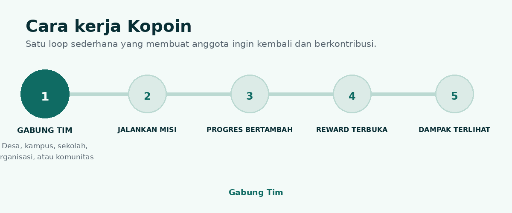
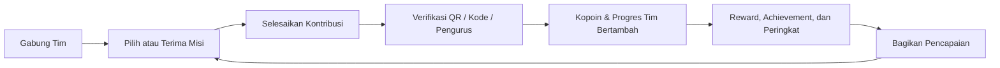
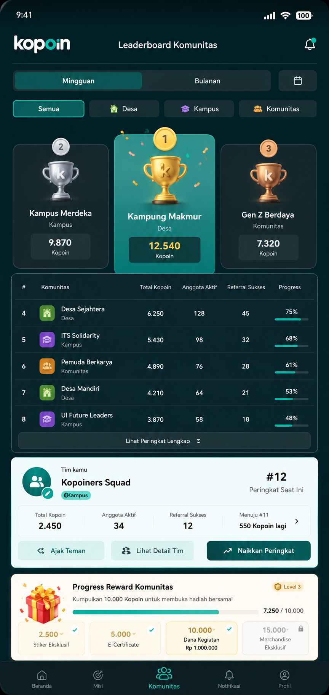
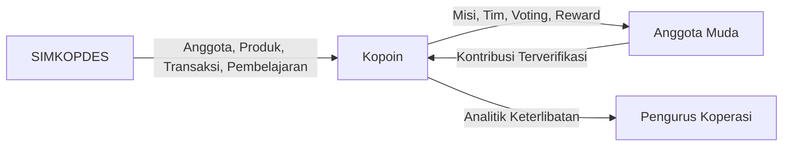
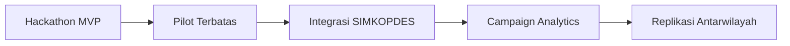
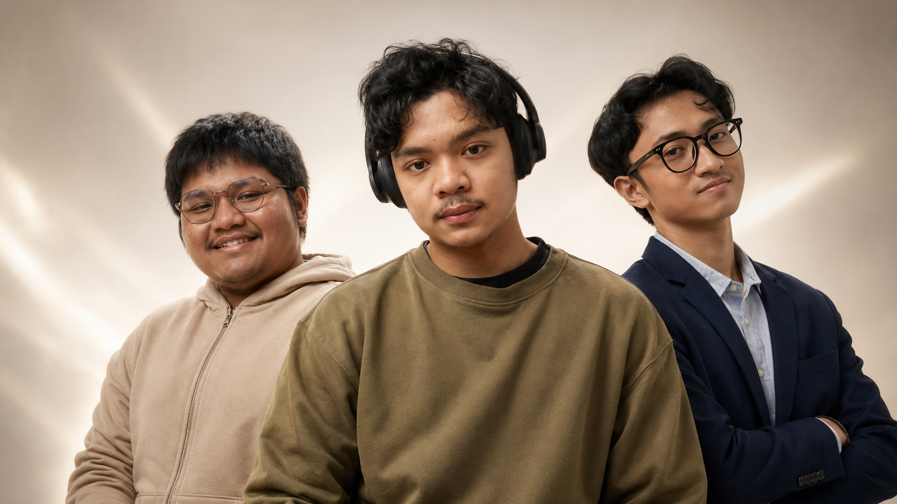

# 🪙 Kopoin

### **Setiap Aksi Punya Nilai**

**Mesin misi dan loyalitas anggota muda untuk ekosistem SIMKOPDES**

  Kopoin mengubah partisipasi koperasi menjadi pengalaman sosial berbasis
  <strong>tim, misi, progres, reward, dan voting komunitas</strong>.

  
  
  

  

---

> **Kopoin bukan sekadar aplikasi poin.**  
> Kopoin dirancang agar anggota muda tidak hanya terdaftar, tetapi juga rutin berpartisipasi, mendukung produk lokal, dan merasa menjadi bagian dari koperasinya.

## Daftar Isi

- [Tentang Kopoin](#tentang-kopoin)
- [Masalah yang Kami Lihat](#masalah-yang-kami-lihat)
- [Solusi yang Kami Tawarkan](#solusi-yang-kami-tawarkan)
- [Cara Kerja](#cara-kerja)
- [Fitur Utama](#fitur-utama)
- [Contoh Pengalaman Pengguna](#contoh-pengalaman-pengguna)
- [Dukungan terhadap SIMKOPDES](#dukungan-terhadap-simkopdes)
- [Dampak yang Ingin Dicapai](#dampak-yang-ingin-dicapai)
- [Teknologi](#teknologi)
- [Roadmap](#roadmap)
- [Demo dan Dokumentasi](#demo-dan-dokumentasi)
- [Tim MechaMinds](#tim-mechaminds)
- [Jejak Kompetisi](#jejak-kompetisi)

---

## Tentang Kopoin

Digitalisasi koperasi telah membuka akses terhadap keanggotaan, perdagangan, pembelajaran, dan pengelolaan kelembagaan. Namun, tersedianya sistem digital belum otomatis membuat generasi muda aktif menggunakannya secara berkelanjutan.

Kopoin hadir untuk menjembatani celah tersebut. Kegiatan seperti membeli produk lokal, mengikuti pembelajaran, mengajak anggota baru, berpartisipasi dalam voting, dan menyelesaikan misi diubah menjadi progres yang dapat dilihat, reward yang dapat dirasakan, serta dampak yang dapat dibagikan kepada komunitas.

### Mengapa bernama **Kopoin**?

Nama **Kopoin** berasal dari kata **Koperasi** dan **Poin**. Nama ini merepresentasikan gagasan utama kami:

> Setiap kontribusi anggota memiliki nilai—bagi dirinya, timnya, koperasi, dan lingkungan sekitar.

---

## Masalah yang Kami Lihat

SIMKOPDES telah menyediakan fondasi digital yang luas. Tantangan berikutnya adalah memastikan generasi muda tidak berhenti pada tahap pendaftaran, tetapi benar-benar terlibat.

| Tantangan | Dampaknya |
|---|---|
| Anggota muda belum memiliki alasan kuat untuk kembali secara rutin | Penggunaan layanan koperasi bersifat sesekali |
| Koperasi masih dipersepsikan formal dan administratif | Sulit menjadi bagian dari keseharian Gen Z |
| Kontribusi anggota kurang terlihat | Rasa memiliki dan kebanggaan komunitas tidak terbentuk |
| Manfaat keanggotaan belum selalu terasa langsung | Anggota sulit melihat alasan untuk tetap aktif |
| Interaksi antaranggotanya masih terbatas | Potensi gotong royong dan pertumbuhan organik belum maksimal |

**Inti masalahnya:** koperasi sudah semakin digital, tetapi belum sepenuhnya menjadi pengalaman yang sosial, menarik, dan relevan bagi generasi muda.

---

## Solusi yang Kami Tawarkan

Kopoin membangun pengalaman koperasi melalui tiga lapisan utama:

<table>
<tr>
<td width="33%" align="center">
<h3>👥 Rasa Memiliki</h3>

Anggota bergabung dalam tim berdasarkan desa, kampus, sekolah, organisasi, atau komunitas.

</td>
<td width="33%" align="center">
<h3>🎯 Alasan untuk Aktif</h3>

Misi, streak, leaderboard, dan achievement memberi tujuan serta progres yang jelas.

</td>
<td width="33%" align="center">
<h3>🎁 Manfaat yang Terasa</h3>

Kopoin, kupon, reward bersama, dan catatan dampak membuat kontribusi lebih bermakna.

</td>
</tr>
</table>

Kopoin tidak hanya memberi penghargaan kepada individu. Sistemnya dirancang agar keberhasilan satu anggota ikut membantu progres tim dan membuka manfaat bersama.

  

---

## Cara Kerja

  

### Core loop

**Gabung tim → jalankan misi → kontribusi diverifikasi → progres bertambah → reward terbuka → pencapaian dibagikan.**

Loop ini membuat koperasi hadir bukan hanya saat anggota membutuhkan layanan, tetapi sebagai bagian dari rutinitas, identitas, dan kebanggaan komunitas.

---

## Fitur Utama

### 1. Aktivasi dan pertumbuhan anggota

| Fitur | Mengapa penting |
|---|---|
| **👥 Tim Komunitas** | Membentuk identitas kelompok dan mendorong anggota untuk saling mengajak serta berkontribusi. |
| **🤝 Referral Anggota Aktif** | Reward diberikan setelah anggota yang diundang benar-benar aktif, sehingga pertumbuhan tidak menghasilkan akun kosong. |
| **🎯 Sistem Misi** | Memberi alasan yang jelas untuk kembali, seperti mendukung produk lokal, check-in, belajar, atau mengajak anggota baru. |

### 2. Kebiasaan dan kompetisi sehat

| Fitur | Mengapa penting |
|---|---|
| **📈 Leaderboard Komunitas** | Menampilkan progres dan kebanggaan tim berdasarkan konsistensi, partisipasi, referral, serta dukungan produk lokal, bukan hanya nominal belanja. |
| **🔥 Streak** | Menjaga konsistensi tanpa harus selalu bertransaksi. Streak dapat diperoleh melalui misi, voting, pembelajaran, dan aktivitas komunitas. |
| **🏆 Achievement** | Mengubah kontribusi menjadi identitas digital yang dapat dikoleksi dan dibagikan. |

### 3. Partisipasi dan demokrasi anggota

| Fitur | Mengapa penting |
|---|---|
| **🗳 Voting Komunitas** | Anggota ikut memilih misi berikutnya, produk yang dipromosikan, UMKM yang didukung, atau reward bersama. |
| **🎁 Reward Bersama** | Saat target tercapai, manfaat dibuka untuk seluruh tim. Inilah gotong royong dalam bentuk yang dapat dirasakan langsung. |
| **🌟 Team Wrap** | Ringkasan pencapaian tim yang mudah dibagikan ke media sosial dan grup komunitas. |

### 4. Manfaat dan dampak

| Fitur | Mengapa penting |
|---|---|
| **🪙 Kopoin** | Penghargaan atas kontribusi yang dapat ditukar menjadi benefit sesuai program koperasi. |
| **🎟 Kupon dan Reward** | Memberikan manfaat yang mudah dipahami, seperti diskon, produk, merchandise, atau benefit mitra. |
| **📸 Impact Receipt** | Menunjukkan hubungan antara kontribusi anggota, target produk lokal, dan progres koperasi. |
| **📊 Campaign Console** | Membantu pengurus membuat misi, memverifikasi kontribusi, mengatur reward, dan memantau hasil program. |

---

## Contoh Pengalaman Pengguna

<table>
<tr>
<td width="58%" valign="top">

Bayangkan **Gabriel tinggal di Desa Sukamaju** dan bergabung dengan **Tim Pemuda Sukamaju** melalui Kopoin.

1. Tim mendapat misi untuk mendukung produk lokal dari Koperasi Merah Putih Sukamaju.
2. Gabriel membeli kopi produksi anggota koperasi dan memindai QR transaksi.
3. Gabriel mendapat Kopoin, streak-nya bertambah, dan progres tim meningkat.
4. Tim Pemuda Sukamaju naik di leaderboard komunitas.
5. Saat target tercapai, seluruh anggota tim membuka kupon bersama.
6. Gabriel memperoleh achievement dan membagikan pencapaiannya ke media sosial.

Satu transaksi tidak berhenti sebagai pembelian. Transaksi tersebut menjadi **progres pribadi, kontribusi tim, dukungan produk lokal, dan cerita komunitas**.

</td>
<td width="42%" align="center" valign="top">

<b>Contoh eksplorasi UI:</b> Leaderboard Komunitas

</td>
</tr>
</table>

---

## Dukungan terhadap SIMKOPDES

Kopoin dirancang sebagai lapisan aktivasi anggota muda yang mendukung ekosistem SIMKOPDES.

| SIMKOPDES menyediakan | Kopoin mengaktifkan |
|---|---|
| Identitas dan data keanggotaan | Tim, misi, referral, dan loyalitas anggota |
| Produk koperasi | Campaign dukungan produk lokal |
| Transaksi | Kopoin, reward, streak, dan catatan dampak |
| Pembelajaran | Misi belajar yang terhubung dengan progres |
| Dashboard kelembagaan | Analitik campaign dan keterlibatan anggota |

> [!NOTE]
> Pada tahap hackathon, integrasi SIMKOPDES ditunjukkan melalui **mock API** dan **mock data**. Arsitektur disiapkan agar dapat terhubung dengan layanan resmi ketika akses integrasi tersedia.

---

## Dampak yang Ingin Dicapai

Kopoin dirancang untuk membantu koperasi:

- meningkatkan jumlah anggota muda yang aktif;
- meningkatkan pembelian dan visibilitas produk lokal;
- memperkuat rasa memiliki terhadap koperasi;
- meningkatkan partisipasi dalam kegiatan komunitas;
- mendorong pertumbuhan anggota melalui referral berkualitas;
- membantu pengurus memahami perilaku dan minat anggota;
- mengubah kegiatan koperasi menjadi pengalaman yang relevan bagi generasi muda.

### Metrik yang relevan

- anggota muda aktif;
- tingkat penyelesaian misi;
- referral yang menjadi anggota aktif;
- penggunaan kupon dan reward;
- transaksi yang dipicu campaign;
- retensi pengguna;
- jumlah produk lokal yang didukung;
- tingkat partisipasi voting.

---

## Teknologi

| Lapisan | Teknologi |
|---|---|
| Mobile application | Flutter, Dart |
| Web application | Next.js, TypeScript |
| Backend API | NestJS, TypeScript |
| Styling | Tailwind CSS |
| Database & Backend Service | Supabase, PostgreSQL |
| Integrasi MVP | Mock API SIMKOPDES |

---

## Roadmap

| Tahap | Fokus |
|---|---|
| **🚀 Hackathon MVP** | Tim, misi, verifikasi QR, Kopoin, reward, leaderboard, voting, dan share |
| **🧪 Pilot** | Implementasi pada koperasi atau komunitas terpilih |
| **🔗 Integrasi SIMKOPDES** | Sinkronisasi anggota, produk, transaksi, dan pembelajaran |
| **📊 Analytics** | Campaign Console dan analitik keterlibatan anggota |
| **🌍 Scale Up** | Replikasi ke koperasi lain di berbagai daerah |

---

## Tim MechaMinds

  

### **Tiga Anggota. Satu arah tujuan.**

Kami adalah tim pengembang dari **Politeknik Negeri Malang** yang menyatukan
**product strategy, artificial intelligence, software engineering, dan visual experience**.
Kami terbiasa bekerja di bawah batas waktu kompetisi: membaca masalah dengan cepat,
memotong ruang lingkup tanpa merusak nilai utama, lalu membawa ide hingga menjadi MVP yang dapat diuji.

  
  
  

> **Kami tidak membagi tim berdasarkan siapa yang paling banyak bicara.**  
> Kami membaginya berdasarkan siapa yang bertanggung jawab memastikan setiap keputusan benar-benar berubah menjadi produk.

<table>
<tr>
<td width="33%" valign="top">
<h3>01 — Gabriel Batavia</h3>
<b>TEAM LEADER · PRODUCT STRATEGY · AI ENGINEERING</b>

Memimpin arah Kopoin, membagi prioritas eksekusi, menyatukan riset dengan keputusan produk, serta menjaga tim bergerak dari konsep menuju MVP yang siap diuji dan dipresentasikan.

<b>Fokus:</b> product leadership, AI/ML, computer vision, system architecture, pitching.

<a href="https://github.com/GabrielBatavia">GitHub ↗</a>

</td>
<td width="33%" valign="top">
<h3>02 — Riovaldo</h3>
<b>SOFTWARE ENGINEER · SYSTEM EXECUTION</b>

Mengubah rancangan menjadi alur aplikasi yang stabil, menghubungkan antarmuka dengan logika sistem, dan memastikan produk tidak berhenti sebagai mockup.

<b>Fokus:</b> frontend, backend, database, integration.

<a href="https://github.com/ckckckcz">GitHub ↗</a>

</td>
<td width="33%" valign="top">
<h3>03 — Raudhil</h3>
<b>FULL-STACK ENGINEER · CREATIVE TECHNOLOGY</b>

Menjembatani fungsi dan pengalaman visual agar produk terasa manusiawi, mudah dipahami, dan memiliki identitas yang kuat ketika digunakan maupun dipresentasikan.

<b>Fokus:</b> full-stack development, visual system, illustration.

<a href="https://github.com/Raudhil">GitHub ↗</a>

</td>
</tr>
</table>

### Ketua Tim — Gabriel Batavia

> **Perannya bukan sekadar mengoordinasikan anggota.**  
> Gabriel bertanggung jawab memastikan masalah dirumuskan dengan tepat, keputusan produk tidak kehilangan arah, dan setiap bagian tim bertemu pada satu hasil akhir yang dapat dipertanggungjawabkan.

| **8 anggota dipimpin** | **hingga 70% peningkatan akurasi** | **3 implementasi proyek perusahaan** | **3 mitra yayasan didukung** |
|:---:|:---:|:---:|:---:|
| Divisi Image Processing | Optimasi pipeline computer vision | Solusi AI untuk kebutuhan nyata | Melalui demo dan use case AI |

<table>
<tr>
<td width="33%" valign="top">
<h3>💼 Pengalaman Profesional</h3>

<b>AI Engineer — CV LetConnect Canada</b> 
Merancang arsitektur LLM dan inference pipeline untuk aplikasi web dan mobile, mendukung peluncuran fitur AI, serta mempresentasikan use case teknis kepada klien dan mitra yayasan.

<b>Computer Vision Engineer Intern — PT Petrokimia Gresik</b> 
Mengembangkan solusi computer vision dan sistem internal yang menggabungkan AI, teknologi web, serta analisis data untuk kebutuhan operasional perusahaan.

<b>Head of Image Processing — Polinema Robotics | AROC_PL</b> 
Memimpin delapan anggota dalam pengembangan pipeline real-time computer vision dan decision-making untuk robot humanoid kompetisi.

</td>
<td width="33%" valign="top">
<h3>🧠 Proyek Pilihan</h3>

<b>LLMForAutism</b> 
Sistem LLM yang dikembangkan bersama Malang Autism Center untuk membantu pendampingan anak dengan autisme verbal.

<b>Sign Language Application</b> 
Aplikasi berbasis computer vision untuk mendukung komunikasi pengguna tuli, dikembangkan bersama dosen dan mitra komunitas.

<b>IoT Peatland Fire Prevention</b> 
Sistem sensor dan monitoring untuk deteksi dini serta pencegahan risiko kebakaran lahan gambut.

<b>AI Game Prototype for PT KAI</b> 
Prototipe permainan berbasis AI yang menggabungkan inovasi produk, pengalaman pengguna, dan eksekusi teknis.

</td>
<td width="33%" valign="top">
<h3>🏆 Rekam Kompetisi</h3>

<b>COMPFEST 16 — Universitas Indonesia</b> 
2nd Runner-Up dan Audience Favorite, AI Innovation Challenge.

<b>KMIPN — Politeknik Negeri Padang</b> 
Juara 2 kategori Cipta Inovasi melalui LLMForAutism.

<b>Electro Weeks National Competition</b> 
Juara 2 melalui sistem IoT pencegahan kebakaran lahan gambut.

<b>Hackathon Compsphere — President University</b> 
Best Innovation Award melalui prototipe game berbasis AI untuk PT KAI.

<b>UI/UX Competition 2024 — YOters Indonesia</b> 
Finalis kompetisi desain produk dan pengalaman pengguna.

</td>
</tr>
</table>

### Cara kami membangun

| Prinsip | Bentuk nyatanya |
|---|---|
| **Masalah sebelum fitur** | Kami mulai dari perilaku pengguna dan hambatan nyata, bukan dari daftar teknologi. |
| **Satu arah, tanggung jawab jelas** | Ketua tim mengunci prioritas; setiap anggota memiliki wilayah eksekusi dan hasil yang dapat diukur. |
| **Produk sebelum presentasi** | Pitch harus ditopang alur, prototype, dan keputusan teknis yang masuk akal. |
| **Cepat tanpa asal jadi** | Kami memotong ruang lingkup, bukan memotong kualitas inti pengalaman. |
| **Kritik tanpa ego** | Ide terbaik yang dipakai—bukan ide milik orang dengan suara paling keras. |

---

## Jejak Kompetisi

### **Podium bukan dekorasi. Ia adalah bukti bahwa ide kami pernah diuji di bawah tekanan.**

Rekam jejak berikut menampilkan pencapaian Gabriel Batavia sebagai Ketua Tim, Riovaldo Alfiyan Fahmi Rahman sebagai anggota, dan Raudhil Firdaus Naufal sebagai anggota dari MechaMinds. Beberapa kompetisi dijalani melalui proyek dan susunan tim yang berbeda.

| Tahun | Kompetisi | Penyelenggara | Pencapaian | Proyek / Kontribusi |
|:----:|---|---|:---:|---|
| **2024** | COMPFEST 16 – AI Innovation Challenge | Universitas Indonesia | 🥈 **2nd Runner-up and Audience Favorite** | Sistem edukasi berbasis LLM untuk membantu mahasiswa memahami kebutuhan industri dan persiapan karier. |
| **2024** | UI/UX Competition | YOters Indonesia | 🎖️ **Finalist** | Merancang pengalaman pengguna berbasis riset dan kebutuhan pengguna. |
| **2025** | Electro Weeks National Competition | Politeknik Negeri Malang | 🥈 **2nd Place** | Sistem IoT untuk deteksi dan pencegahan kebakaran lahan gambut. |
| **2025** | Hackathon Compsphere | President University | 🏆 **Best Innovation Award** | Prototipe permainan berbasis AI untuk PT Kereta Api Indonesia. |
| **2025** | Hackathon The Sandbox | Institut Teknologi Bandung | ⭐ **Favorite Challenge Award** | **GrowPlus**, aplikasi web SNP yang menyediakan rekomendasi menu bergizi sesuai kondisi ekonomi, lokasi, dan kebutuhan gizi keluarga. |
| **2025** | KMIPN – Cipta Inovasi | Politeknik Negeri Padang | 🥈 **2nd Place** | **LLMForAutism**, solusi LLM untuk membantu anak dengan autisme verbal melalui pendekatan berbasis AI. |
| **2025** | Internal Competition | Politeknik Negeri Malang | 🥉 **3nd Place** | **GrowPlus**, aplikasi web SNP yang menyediakan rekomendasi menu bergizi sesuai kondisi ekonomi, lokasi, dan kebutuhan gizi keluarga. |
| **2026** | REFACTORY Hackathon | Universitas Gadjah Mada | 🥉 **3nd Place with innovation star** | **Legacyver**, platform dokumentasi berbasis AI yang menganalisis codebase dan menghasilkan dokumentasi teknis secara otomatis. |
| **2026** | Digital Cooperatives Expo | Koperasi Point × MechaMinds | 🚀 **Team Leader** | Mengembangkan **Koperasi Point**, mesin aktivasi dan loyalitas anggota muda untuk ekosistem SIMKOPDES. |

> **Kami tidak membawa daftar lomba untuk terlihat sibuk.**  
> Kami membawanya sebagai bukti bahwa tim ini telah berulang kali menghadapi validasi, batas waktu, kritik juri, dan tuntutan untuk menghasilkan solusi yang benar-benar dapat dijelaskan.

---

## Catatan Proyek

Proyek ini dikembangkan oleh **Tim MechaMinds** untuk kompetisi Hackathon Digital Cooperatives Expo 2026 pada pilar **Literasi Gen Z & Gen Alpha dalam Berkoperasi**.

---

### **Kopoin — Setiap Aksi Punya Nilai**

Dari anggota muda, untuk koperasi yang lebih hidup.

