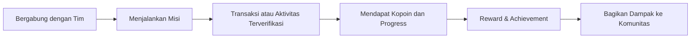

# Kopoin

> **Mesin Misi dan Loyalitas Anggota Muda untuk SIMKOPDES**

Kopoin adalah platform aktivasi anggota muda yang dirancang untuk meningkatkan partisipasi, loyalitas, dan keterlibatan komunitas dalam ekosistem SIMKOPDES melalui misi, reward, gamifikasi, serta kolaborasi sosial.

**Pilar:** Literasi Gen Z & Gen Alpha
**Tim:** MechaMinds

---

## Tentang Kopoin

Digitalisasi koperasi telah membuka akses terhadap berbagai layanan seperti keanggotaan, perdagangan, pembelajaran, dan pengelolaan kelembagaan. Namun, digitalisasi saja belum cukup untuk membuat generasi muda aktif berpartisipasi secara berkelanjutan.

Kopoin hadir sebagai lapisan aktivasi yang melengkapi SIMKOPDES dengan menghadirkan pengalaman yang lebih dekat dengan kebiasaan Gen Z dan Gen Alpha. Setiap aktivitas anggota, mulai dari membeli produk lokal, mengikuti pembelajaran, menyelesaikan misi, hingga mengajak anggota baru, diubah menjadi pengalaman yang memberikan progres, penghargaan, dan dampak nyata bagi komunitas.

---

## Mengapa Bernama Kopoin?

Nama **Kopoin** merupakan gabungan dari kata **Koperasi** dan **Poin**. Nama ini mencerminkan bagaimana setiap kontribusi anggota diubah menjadi nilai yang dapat dilihat, dirasakan, dan dibagikan kepada komunitas.

---

## Permasalahan

Walaupun koperasi telah memiliki sistem digital, keterlibatan anggota muda masih menjadi tantangan.

Beberapa penyebab utamanya antara lain:

* Anggota belum memiliki alasan untuk kembali menggunakan layanan koperasi secara rutin.
* Aktivitas koperasi masih dipersepsikan sebatas administrasi dan transaksi.
* Kontribusi anggota belum terlihat secara nyata bagi diri sendiri maupun komunitas.
* Belum tersedia pengalaman digital yang menarik, interaktif, dan bersifat sosial seperti yang telah terbiasa digunakan oleh generasi muda.

---

## Solusi

Kopoin mengubah aktivitas koperasi menjadi pengalaman yang lebih menarik melalui pendekatan gamifikasi dan komunitas.

Setiap anggota dapat:

* Bergabung dengan tim komunitas.
* Menyelesaikan berbagai misi.
* Melakukan transaksi produk lokal.
* Mengumpulkan Kopoin.
* Membuka achievement.
* Menjaga streak aktivitas.
* Mengikuti voting komunitas.
* Mendapatkan reward bersama.
* Membagikan pencapaian kepada teman.

Dengan pendekatan tersebut, koperasi tidak hanya menjadi tempat bertransaksi, tetapi juga menjadi ruang kolaborasi dan pertumbuhan komunitas.

---

## Target Pengguna

* Anggota muda koperasi
* Pengurus koperasi
* Komunitas desa
* UMKM lokal
* SIMKOPDES sebagai ekosistem digital koperasi

---

## Cara Kerja

---

## Fitur Utama

| Fitur               | Manfaat                                        |
| ------------------- | ---------------------------------------------- |
| 🎯 Mission System   | Memberikan tujuan yang jelas kepada anggota.   |
| 👥 Team Community   | Mendorong kolaborasi antaranggota.             |
| 📈 Leaderboard      | Memunculkan kompetisi yang sehat.              |
| 🔥 Streak           | Membentuk kebiasaan menggunakan koperasi.      |
| 🏆 Achievement      | Mengapresiasi kontribusi anggota.              |
| 🪙 Kopoin           | Reward atas setiap aktivitas yang dilakukan.   |
| 🎁 Voucher & Reward | Memberikan manfaat nyata bagi anggota.         |
| 🗳 Community Voting | Anggota ikut menentukan kampanye komunitas.    |
| 🤝 Referral         | Mengembangkan komunitas secara organik.        |
| 📊 Campaign Console | Membantu pengurus mengelola kampanye koperasi. |
| 📸 Impact Receipt   | Menampilkan dampak setiap kontribusi anggota.  |
| 🌟 Team Wrap        | Ringkasan pencapaian yang dapat dibagikan.     |

---

## Dukungan terhadap SIMKOPDES

Kopoin tidak menggantikan SIMKOPDES, melainkan melengkapinya sebagai lapisan aktivasi anggota muda.

| SIMKOPDES        | Kopoin             |
| ---------------- | ------------------ |
| Data Keanggotaan | Aktivasi Anggota   |
| Produk Koperasi  | Misi Produk Lokal  |
| Transaksi        | Reward & Kopoin    |
| Pembelajaran     | Learning Mission   |
| Dashboard        | Campaign Analytics |

Pada tahap hackathon, integrasi ditunjukkan menggunakan **mock API** dan **mock data**, sehingga arsitektur telah siap untuk dihubungkan dengan layanan SIMKOPDES ketika akses resmi tersedia.

---

## Dampak yang Diharapkan

Kopoin dirancang untuk membantu koperasi:

* meningkatkan keterlibatan anggota muda,
* meningkatkan pembelian produk lokal,
* memperkuat rasa memiliki terhadap koperasi,
* meningkatkan partisipasi dalam kegiatan komunitas,
* mendorong pertumbuhan anggota melalui referral,
* menyediakan data perilaku anggota sebagai dasar pengambilan keputusan kampanye.

---

## Teknologi

* React Native
* Expo
* TypeScript
* Tailwind CSS
* MySQL
* Mock API SIMKOPDES

---

## Roadmap

| Tahap                  | Fokus                                                  |
| ---------------------- | ------------------------------------------------------ |
| 🚀 Hackathon MVP       | Mission, Team, QR Verification, Reward, Share          |
| 🧪 Pilot               | Implementasi pada koperasi atau komunitas terpilih     |
| 🔗 Integrasi SIMKOPDES | Sinkronisasi data anggota, transaksi, dan pembelajaran |
| 📊 Analytics           | Campaign Console dan analitik perilaku anggota         |
| 🌍 Scale Up            | Replikasi ke koperasi lain di berbagai daerah          |

---

## Demo

* 🌐 Demo Aplikasi: `TAMBAHKAN_LINK`
* 🎥 Video Demo: `TAMBAHKAN_LINK`
* 📄 Blueprint Produk: `TAMBAHKAN_LINK`

---

## Tim MechaMinds

| Foto | Nama | Peran |
|------|------|-------|
|  | [Gabriel](https://github.com/GabrielBatavia) | Ketua Tim |
|  | [Riovaldo](https://github.com/ckckckcz) | Anggota |
|  | [Raul](https://github.com/Raudhil) | Anggota |

---

## Lisensi

Proyek ini dikembangkan sebagai bagian dari kompetisi **Hackathon SIMKOPDES** oleh Tim **MechaMinds**.
