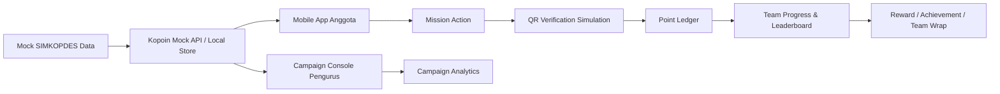

# Kopoin MVP Sprint Plan

**Produk:** Kopoin - Setiap Aksi Punya Nilai  
**Tim:** MechaMinds  
**Konteks:** Hackathon Digital Cooperatives Expo 2026 - Pilar Literasi Gen Z & Gen Alpha dalam Berkoperasi  
**Versi Dokumen:** v1.0  
**Tanggal:** 4 Juli 2026  
**Disusun untuk:** Eksekusi MVP, pembagian kerja tim, tracking sprint, persiapan demo, dan validasi awal.

---

## 1. Ringkasan Eksekutif

Kopoin adalah lapisan aktivasi dan loyalitas anggota muda untuk ekosistem SIMKOPDES. Fokus MVP bukan membangun ulang sistem koperasi, marketplace, pembayaran, atau dashboard legal yang sudah ada. Fokus MVP adalah membuktikan satu loop perilaku yang sederhana tetapi kuat:

> Anggota muda bergabung dalam tim, menjalankan misi koperasi, kontribusinya diverifikasi, poin dan progres tim bertambah, manfaat bersama semakin dekat, lalu pencapaian dibagikan.

MVP hackathon harus bisa mendemokan campaign:

> **"7 Hari Dukung Produk Koperasi Sukamaju"**

Dalam demo, pengguna bernama Gabriel bergabung dengan **Tim Pemuda Sukamaju**, melihat misi produk lokal, melakukan scan QR transaksi kopi koperasi, mendapat Kopoin, streak, achievement, progres tim bertambah, leaderboard berubah, pengurus melihat aktivitas masuk pada Campaign Console, lalu pengguna membagikan Team Wrap.

Dokumen ini membagi pekerjaan menjadi sprint yang realistis untuk eksekusi cepat, dengan prioritas keras pada core loop end-to-end.

---

## 2. Sumber yang Dipelajari

Dokumen ini dibuat berdasarkan aset proyek yang tersedia di repository Kopoin:

| Sumber | Fungsi dalam Sprint Plan |
|---|---|
| `README.md` | Memahami positioning, fitur utama, teknologi, tim, roadmap, dan narasi produk. |
| `docs/Blueprint_Kopoin_MechaMinds_v1.pdf` | Memahami problem statement, persona, user journey, MVP 48 jam, arsitektur, risiko, KPI pilot, dan batasan scope. |
| `assets/kopoin-hero.png` | Referensi identitas visual dan pesan utama. |
| `assets/kopoin-feature-strip.png` | Referensi tiga mekanisme utama: rasa memiliki, alasan aktif, manfaat terasa. |
| `assets/kopoin-leaderboard.png` | Referensi UI leaderboard komunitas. |
| `assets/kopoin-loop.gif` | Referensi core loop Kopoin. |
| `assets/profile-hero.png` | Referensi profil tim untuk dokumentasi dan presentasi. |

---

## 3. Tujuan MVP

### 3.1 Tujuan Produk

MVP harus menjawab satu pertanyaan utama:

> Apakah Kopoin mampu membuat anggota muda melihat koperasi sebagai pengalaman yang aktif, sosial, bermanfaat, dan layak diulang?

### 3.2 Tujuan Demo Hackathon

MVP harus mampu menunjukkan:

1. Pengguna muda dapat masuk sebagai anggota koperasi simulasi.
2. Pengguna dapat bergabung ke tim komunitas.
3. Pengguna dapat melihat misi koperasi yang konkret.
4. Pengguna dapat menyelesaikan kontribusi melalui QR simulasi.
5. Sistem dapat memberi Kopoin, streak, achievement, dan progres tim.
6. Leaderboard berubah berdasarkan kontribusi.
7. Pengguna dapat ikut voting misi/reward/produk berikutnya.
8. Pengurus dapat melihat hasil campaign melalui Campaign Console.
9. Pengguna dapat membagikan pencapaian berupa Team Wrap.

### 3.3 Tujuan Teknis

MVP harus cukup stabil untuk demo langsung. Artinya:

- tidak harus terintegrasi ke SIMKOPDES produksi;
- wajib memiliki mock API dan mock data yang konsisten;
- wajib memiliki state perubahan yang terlihat saat demo;
- wajib memiliki fallback demo apabila scan kamera gagal;
- wajib memiliki alur yang dapat direkam untuk video demo;
- wajib memiliki dokumentasi setup dan script demo.

---

## 4. Prinsip Produk

| Prinsip | Makna untuk MVP |
|---|---|
| Masalah sebelum fitur | Jangan menambah fitur yang tidak memperkuat aktivasi anggota muda. |
| Core loop harus hidup | Lebih baik sedikit fitur tetapi end-to-end daripada banyak layar yang tidak tersambung. |
| Utility first | Poin, kupon, hemat, dan progres harus terasa jelas. |
| Sosial, bukan individual saja | Tim, leaderboard, voting, dan reward bersama harus muncul dalam demo. |
| Tidak pay-to-win | Leaderboard tidak boleh hanya terlihat berdasarkan nominal belanja. |
| Tidak klaim integrasi palsu | Gunakan mock API SIMKOPDES secara eksplisit. |
| Aman secara narasi | Kopoin bukan dompet digital, bukan sistem pembayaran, dan bukan pengganti RAT. |
| Presentable | UI harus cukup premium untuk pitch deck, video, dan penilaian juri. |

---

## 5. Scope MVP

### 5.1 Wajib Selesai

| Area | Detail |
|---|---|
| Core loop end-to-end | Onboarding simulasi -> gabung tim -> misi -> scan QR -> poin/progres -> reward/share. |
| QR simulasi | QR valid untuk produk lokal, minimal fallback input kode manual. |
| Tim dan leaderboard | Tim Pemuda Sukamaju naik setelah aksi berhasil. |
| Dashboard hasil | Campaign Console menampilkan aktivitas, progres, anggota aktif, dan tim. |
| Mock data SIMKOPDES | Data anggota, koperasi, produk, transaksi, pembelajaran, dan campaign simulasi. |
| Script demo | Narasi demo 3-5 menit dan data yang sudah disiapkan. |

### 5.2 Bagus Jika Selesai

| Area | Detail |
|---|---|
| Kupon | Reward bersama atau kupon yang semakin dekat terbuka. |
| Referral aktif | Undang anggota baru dan poin baru muncul setelah aktivasi/misi pertama. |
| Voting | Pengguna memilih produk/reward berikutnya. |
| Share card | Team Wrap atau achievement card yang dapat disimpan/dibagikan. |
| Achievement detail | Badge dengan nama khas seperti "Anak Lokal, Selera Global". |

### 5.3 Jangan Dipaksakan

| Area | Alasan |
|---|---|
| Dompet digital | Risiko legal, teknis, dan scope terlalu besar. |
| WebAR kompleks | Tidak relevan untuk validasi core loop. |
| Integrasi produksi SIMKOPDES | Akses belum tersedia dan tidak perlu untuk demo awal. |
| Marketplace baru | SIMKOPDES sudah memiliki ekosistem perdagangan; Kopoin cukup menempel sebagai engagement layer. |
| Sistem pembayaran | Kopoin bukan payment platform. |
| RAT digital | Voting di Kopoin hanya untuk campaign/reward, bukan keputusan legal koperasi. |

---

## 6. Persona MVP

### 6.1 Anggota Muda

**Nama demo:** Gabriel  
**Umur:** 21 tahun  
**Konteks:** Mahasiswa/anggota muda di Desa Sukamaju  
**Kebutuhan utama:** manfaat yang jelas, progres sosial, tim, reward, dan pengalaman yang tidak terasa administratif.

**Motivasi membuka Kopoin:**

- ada kupon atau penghematan yang nyata;
- timnya naik peringkat;
- streak hampir terbuka;
- achievement bisa dibagikan;
- ikut mendukung produk lokal bersama teman.

### 6.2 Pengurus Koperasi

**Nama demo:** Pengurus KMP Sukamaju  
**Kebutuhan utama:** membuat campaign sederhana, melihat progres, memverifikasi aksi, dan memahami apakah anggota muda aktif.

**Motivasi menggunakan Kopoin:**

- produk koperasi lebih terlihat;
- campaign lebih mudah dipantau;
- aktivitas anggota muda dapat diukur;
- reward dapat diarahkan pada perilaku yang diinginkan.

### 6.3 Juri / Stakeholder Pemerintah

**Kebutuhan utama:** melihat bahwa produk ini melengkapi SIMKOPDES, realistis, tidak menduplikasi sistem inti, dan punya KPI pilot yang jelas.

**Yang harus terlihat dalam demo:**

- posisi Kopoin sebagai activation layer;
- mock API SIMKOPDES;
- data engagement yang bisa kembali ke pengurus/pemerintah;
- risiko dan batasan legal sudah dipahami.

---

## 7. Demo Scenario Utama

### 7.1 Data Demo

| Entitas | Nilai Demo |
|---|---|
| Koperasi | Koperasi Merah Putih Sukamaju |
| Campaign | 7 Hari Dukung Produk Koperasi Sukamaju |
| Pengguna | Gabriel |
| Tim pengguna | Tim Pemuda Sukamaju |
| Produk utama | Kopi Sukamaju |
| Target misi | 100 transaksi produk lokal |
| Progres sebelum scan | 73/100 |
| Progres setelah scan | 74/100 |
| Poin transaksi | +120 Kopoin |
| Saldo setelah transaksi | 1.850 Kopoin |
| Penghematan simulasi | Rp37.500 bulan ini |
| Streak | 3 minggu dukung produk desa |
| Achievement | Anak Lokal, Selera Global |
| Leaderboard sebelum | Pemuda Sukamaju peringkat 3 |
| Leaderboard setelah | Pemuda Sukamaju peringkat 2 |
| Community unlock | 26 aksi lagi untuk kupon bersama |
| Voting | Pilih produk/reward campaign berikutnya |

### 7.2 Alur Demo 3-5 Menit

1. Buka aplikasi Kopoin.
2. Tampilkan kartu anggota digital Gabriel.
3. Tampilkan Tim Pemuda Sukamaju dan misi minggu ini.
4. Buka detail misi "100 transaksi produk lokal".
5. Scan QR produk Kopi Sukamaju.
6. Tampilkan success screen: +120 Kopoin, streak bertambah, achievement terbuka.
7. Tampilkan progres tim naik dari 73/100 ke 74/100.
8. Tampilkan leaderboard: Tim Pemuda Sukamaju naik peringkat.
9. Tampilkan voting produk/reward berikutnya.
10. Pindah ke Campaign Console: pengurus melihat transaksi/aksi masuk.
11. Tampilkan Team Wrap yang siap dibagikan.
12. Tutup dengan pesan: "Datang karena manfaat. Kembali karena tim. Bertahan karena merasa memiliki."

---

## 8. Struktur Tim dan Tanggung Jawab

### 8.1 Role Utama

| Anggota | Role | Tanggung Jawab Utama |
|---|---|---|
| Gabriel Batavia | Team Lead, Product Strategy, Architecture, Pitch | Mengunci scope, backlog, prioritas, narasi produk, demo scenario, quality gate, dokumentasi, dan pitching. |
| Riovaldo | Full-stack Engineer, System Execution | Implementasi core logic, mock API, database/mock store, integrasi state, admin console, dan stabilitas demo. |
| Raudhil | Full-stack Engineer, Creative Technology, Visual System | Implementasi UI mobile, visual polish, komponen desain, animasi ringan, share card, dan konsistensi brand. |

### 8.2 RACI Matrix

RACI: Responsible = mengerjakan, Accountable = pemilik hasil, Consulted = memberi input, Informed = perlu tahu.

| Aktivitas | Gabriel | Riovaldo | Raudhil |
|---|---|---|---|
| Scope MVP | A/R | C | C |
| Backlog sprint | A/R | C | C |
| Arsitektur mock API | A/C | R | C |
| Data model | A/C | R | C |
| Mobile app core loop | A/C | R | R |
| UI visual system | C | C | A/R |
| Campaign Console | A/C | R | C |
| Leaderboard scoring | A/C | R | C |
| QR simulation | C | A/R | C |
| Voting | A/C | R | R |
| Reward dan achievement | A/C | R | R |
| Demo script | A/R | C | C |
| QA final | A/R | R | R |
| README dan dokumentasi | A/R | C | C |
| Pitch deck/video demo | A/R | C | R |

---

## 9. Tech Stack dan Keputusan Implementasi

### 9.1 Stack yang Direncanakan

| Layer | Teknologi |
|---|---|
| Mobile Application | React Native, Expo, TypeScript |
| Styling | Tailwind CSS / utility styling sesuai setup proyek |
| Data | MySQL untuk desain produksi; mock JSON/local store untuk hackathon apabila waktu terbatas |
| API MVP | Mock API SIMKOPDES |
| Admin Console | Expo Web atau screen admin sederhana yang bisa didemokan |
| QR | QR scanner simulasi atau input kode manual fallback |
| Share Card | Generated card berbasis layout komponen atau screenshot-ready view |

### 9.2 Keputusan Teknis Sprint

| Keputusan | Alasan |
|---|---|
| Gunakan mock API lebih dulu | Integrasi SIMKOPDES produksi belum tersedia. |
| Seed data harus deterministik | Demo harus konsisten dan tidak tergantung jaringan. |
| Simpan state demo secara lokal | Perubahan progres harus terlihat tanpa backend kompleks. |
| QR punya fallback kode manual | Demo tidak boleh gagal karena kamera, permission, atau device. |
| Leaderboard dihitung sederhana tetapi dapat dijelaskan | Juri perlu memahami fairness tanpa melihat algoritma kompleks. |
| Campaign Console boleh minimal | Yang penting pengurus dapat melihat aksi masuk dan progres campaign. |
| Share card boleh screenshot-ready | Tidak harus integrasi native share apabila waktu sempit. |

---

## 10. Arsitektur MVP



### 10.1 Modul Utama

| Modul | Fungsi |
|---|---|
| Auth/Onboarding Simulasi | Masuk sebagai anggota demo tanpa autentikasi produksi. |
| Member Card | Menampilkan identitas anggota, status, level, QR anggota, dan benefit ringkas. |
| Team Module | Gabung tim, lihat anggota aktif, progres, dan posisi tim. |
| Mission Engine | Menampilkan misi, target, progress, poin, deadline, dan aturan. |
| QR Verification | Validasi QR produk/transaksi simulasi dan anti-duplikasi sederhana. |
| Points & Streak | Mencatat Kopoin, streak, dan histori kontribusi. |
| Achievement | Membuka badge setelah kondisi tertentu terpenuhi. |
| Leaderboard | Menghitung dan menampilkan skor tim. |
| Voting | Memilih produk/reward/campaign berikutnya. |
| Reward | Menampilkan kupon atau community unlock. |
| Team Wrap | Ringkasan shareable pencapaian tim. |
| Campaign Console | Dashboard pengurus untuk membuat/memantau campaign dan aktivitas. |

---

## 11. Data Model MVP

### 11.1 Entity Overview

| Entity | Deskripsi |
|---|---|
| `User` | Anggota muda yang memakai aplikasi. |
| `Cooperative` | Koperasi tempat campaign berjalan. |
| `Team` | Komunitas pengguna, misalnya Tim Pemuda Sukamaju. |
| `Product` | Produk lokal koperasi yang didukung campaign. |
| `Campaign` | Program aktivasi tertentu, misalnya 7 Hari Dukung Produk Koperasi Sukamaju. |
| `Mission` | Tugas yang harus diselesaikan pengguna/tim. |
| `MissionAction` | Aksi terverifikasi yang dilakukan pengguna. |
| `QrCode` | Kode produk/transaksi simulasi. |
| `PointLedger` | Riwayat penambahan/pengurangan Kopoin. |
| `Streak` | Rekam konsistensi mingguan pengguna. |
| `Achievement` | Badge yang terbuka karena kondisi tertentu. |
| `Reward` | Kupon atau community unlock. |
| `VotePoll` | Voting untuk produk/reward/misi berikutnya. |
| `VoteOption` | Opsi dalam voting. |
| `Vote` | Pilihan pengguna pada voting. |
| `TeamScoreSnapshot` | Snapshot skor leaderboard. |
| `AuditLog` | Catatan aktivitas penting untuk demo anti-fraud. |

### 11.2 Field Minimal

#### User

| Field | Tipe | Contoh |
|---|---|---|
| `id` | string | `usr_gabriel` |
| `name` | string | `Gabriel` |
| `ageGroup` | string | `Gen Z` |
| `memberNo` | string | `KMP-SKM-0001` |
| `cooperativeId` | string | `coop_sukamaju` |
| `teamId` | string/null | `team_pemuda_sukamaju` |
| `level` | number | `3` |
| `kopoinBalance` | number | `1850` |
| `monthlySaving` | number | `37500` |
| `status` | string | `Anggota Aktif` |

#### Campaign

| Field | Tipe | Contoh |
|---|---|---|
| `id` | string | `camp_7hari_produk_lokal` |
| `title` | string | `7 Hari Dukung Produk Koperasi Sukamaju` |
| `cooperativeId` | string | `coop_sukamaju` |
| `startDate` | date | `2026-07-01` |
| `endDate` | date | `2026-07-07` |
| `targetType` | string | `transaction_count` |
| `targetValue` | number | `100` |
| `currentValue` | number | `73` before scan, `74` after scan |
| `rewardId` | string | `reward_kupon_bersama` |
| `status` | string | `active` |

#### Mission

| Field | Tipe | Contoh |
|---|---|---|
| `id` | string | `mis_beli_kopi_sukamaju` |
| `campaignId` | string | `camp_7hari_produk_lokal` |
| `title` | string | `Beli Produk Lokal` |
| `description` | string | `Beli Kopi Sukamaju dan scan QR transaksi.` |
| `points` | number | `120` |
| `actionType` | string | `qr_scan` |
| `isTeamMission` | boolean | `true` |
| `deadline` | date | `2026-07-07` |

#### MissionAction

| Field | Tipe | Contoh |
|---|---|---|
| `id` | string | `act_001` |
| `userId` | string | `usr_gabriel` |
| `teamId` | string | `team_pemuda_sukamaju` |
| `missionId` | string | `mis_beli_kopi_sukamaju` |
| `productId` | string | `prod_kopi_sukamaju` |
| `qrCode` | string | `KOPI-SUKAMAJU-QR-001` |
| `pointsEarned` | number | `120` |
| `status` | string | `verified` |
| `createdAt` | datetime | demo timestamp |

#### TeamScoreSnapshot

| Field | Tipe | Contoh |
|---|---|---|
| `teamId` | string | `team_pemuda_sukamaju` |
| `campaignId` | string | `camp_7hari_produk_lokal` |
| `score` | number | `7930` |
| `rank` | number | `2` |
| `activeMembersWeight` | number | `28` |
| `consistencyWeight` | number | `32` |
| `localProductWeight` | number | `25` |
| `learningVotingWeight` | number | `15` |

---

## 12. Scoring Leaderboard MVP

### 12.1 Tujuan Scoring

Leaderboard harus terlihat kompetitif, tetapi tidak boleh memberi kesan bahwa koperasi berubah menjadi ajang siapa paling banyak belanja. Skor MVP harus memperlihatkan empat komponen:

| Komponen | Bobot | Contoh Data |
|---|---:|---|
| Konsistensi | 32% | streak mingguan, penyelesaian misi rutin |
| Anggota aktif | 28% | persentase anggota tim yang menyelesaikan misi |
| Produk lokal | 25% | transaksi/dukungan pada produk koperasi |
| Belajar & voting | 15% | penyelesaian pembelajaran dan partisipasi voting |

### 12.2 Formula Sederhana MVP

```text
team_score =
  consistency_score * 0.32 +
  active_member_score * 0.28 +
  local_product_score * 0.25 +
  learning_voting_score * 0.15
```

Untuk demo, angka boleh menggunakan seed data agar hasil stabil. Setelah Gabriel scan QR, tambahkan delta skor ke Tim Pemuda Sukamaju sehingga tim naik dari peringkat 3 ke peringkat 2.

### 12.3 Acceptance Criteria Scoring

- Leaderboard menampilkan minimal 3 tim.
- Setiap tim memiliki skor dan ranking.
- Ada breakdown skor agar leaderboard tidak terlihat asal.
- Setelah transaksi berhasil, skor Tim Pemuda Sukamaju berubah.
- Ranking berubah pada demo atau minimal progress bar tim naik signifikan.
- Ada teks penjelasan bahwa skor tidak hanya nominal belanja.

---

## 13. Mock API Contract

### 13.1 Endpoint Mobile

| Method | Endpoint | Fungsi | Prioritas |
|---|---|---|---|
| GET | `/api/bootstrap` | Mengambil data awal user, koperasi, tim, campaign, mission, reward. | P0 |
| GET | `/api/member/:id` | Mengambil kartu anggota dan saldo Kopoin. | P0 |
| POST | `/api/team/join` | Gabung ke tim. | P0 |
| GET | `/api/campaigns/active` | Mengambil campaign aktif. | P0 |
| GET | `/api/missions` | Mengambil daftar misi. | P0 |
| GET | `/api/missions/:id` | Detail misi. | P0 |
| POST | `/api/qr/validate` | Validasi QR produk/transaksi simulasi. | P0 |
| POST | `/api/actions/submit` | Submit aksi misi dan update poin/progres. | P0 |
| GET | `/api/leaderboard` | Mengambil leaderboard tim. | P0 |
| GET | `/api/rewards` | Mengambil reward/kupon/community unlock. | P1 |
| GET | `/api/achievements` | Mengambil achievement user. | P1 |
| POST | `/api/votes` | Submit voting user. | P1 |
| GET | `/api/team-wrap/:teamId` | Mengambil data share card. | P1 |

### 13.2 Endpoint Campaign Console

| Method | Endpoint | Fungsi | Prioritas |
|---|---|---|---|
| GET | `/api/admin/dashboard` | Ringkasan campaign: anggota aktif, completion, transaksi, produk. | P0 |
| GET | `/api/admin/campaigns/:id` | Detail campaign. | P0 |
| POST | `/api/admin/campaigns` | Membuat campaign simulasi. | P1 |
| GET | `/api/admin/actions` | Daftar aksi masuk dan status verifikasi. | P0 |
| PATCH | `/api/admin/actions/:id/verify` | Verifikasi aksi manual. | P1 |
| GET | `/api/admin/teams` | Performa tim pada campaign. | P0 |
| GET | `/api/admin/products` | Produk lokal yang masuk campaign. | P1 |

### 13.3 Fallback Tanpa Backend

Apabila waktu terlalu sempit, endpoint di atas boleh diganti dengan:

- file `seed.ts` / `seed.json`;
- state management lokal;
- fungsi service seperti `submitMissionAction()`, `validateQrCode()`, `getLeaderboard()`;
- persistence sederhana dengan local storage.

Yang penting, demo tetap menunjukkan perubahan state.

---

## 14. Sprint Strategy

Dokumen ini memakai dua lapisan sprint:

1. **Hackathon MVP Sprint 48 Jam** - fokus membuat demo end-to-end.
2. **Pilot-Ready Sprint 2 Minggu** - opsi setelah hackathon untuk membuat MVP lebih layak diuji pada koperasi nyata.

Sprint 48 jam adalah prioritas utama. Sprint 2 minggu hanya disiapkan agar roadmap setelah lomba jelas.

---

# BAGIAN A - Hackathon MVP Sprint 48 Jam

---

## 15. Target 48 Jam

### 15.1 Definition of Done untuk MVP Hackathon

MVP dianggap selesai apabila:

- user dapat menjalankan alur dari onboarding sampai Team Wrap;
- scan QR simulasi berhasil dan mengubah data poin/progres;
- leaderboard dan campaign dashboard berubah setelah aksi;
- voting/reward minimal dapat ditampilkan, lebih baik jika interaktif;
- demo dapat dijalankan ulang minimal 3 kali tanpa crash;
- video demo dapat direkam dengan alur yang sama;
- README menjelaskan bahwa integrasi SIMKOPDES masih mock API;
- tidak ada klaim bahwa sistem sudah produksi atau terhubung resmi.

### 15.2 Timebox Utama

| Timebox | Fokus | Output |
|---|---|---|
| T+0 - T+3 jam | Alignment dan setup | Scope lock, repo siap, desain rute, seed data awal. |
| T+3 - T+12 jam | UI shell dan core data | Struktur screen, navigation, mock service, visual system. |
| T+12 - T+24 jam | Core loop pengguna | Misi, QR, success, poin, progress, leaderboard. |
| T+24 - T+36 jam | Admin, voting, reward, share | Campaign Console, voting, kupon, Team Wrap. |
| T+36 - T+44 jam | QA, polish, demo hardening | Bug fix, fallback, copywriting, visual polish. |
| T+44 - T+48 jam | Final packaging | Video demo, README update, screenshot, final rehearsal. |

---

## 16. Sprint 0 - Alignment, Scope Lock, dan Setup

**Durasi:** T+0 sampai T+3 jam  
**Tujuan:** Mengunci scope agar tim tidak melebar dan semua orang membangun alur yang sama.

### 16.1 Output Sprint 0

| Output | Owner | Status Target |
|---|---|---|
| Final demo scenario | Gabriel | Selesai dalam 45 menit pertama |
| Backlog P0/P1/P2 | Gabriel | Selesai |
| Struktur route/screen | Riovaldo + Raudhil | Selesai |
| Seed data demo | Gabriel + Riovaldo | Selesai |
| Visual tokens | Raudhil | Selesai |
| Repository convention | Semua | Selesai |

### 16.2 Task Detail

| ID | Task | Owner | Estimasi | Acceptance Criteria |
|---|---|---|---:|---|
| KOP-000 | Kickoff 30 menit: samakan demo, scope, dan pembagian kerja | Gabriel | 0.5h | Semua anggota tahu alur demo dan tugas masing-masing. |
| KOP-001 | Buat daftar screen final | Gabriel + Raudhil | 0.5h | Ada daftar screen mobile dan admin yang tidak berubah tanpa persetujuan lead. |
| KOP-002 | Setup project/run command | Riovaldo | 1h | Project bisa dijalankan di minimal 1 device/emulator. |
| KOP-003 | Buat seed data demo | Riovaldo | 1h | Data user, team, campaign, product, mission, leaderboard tersedia. |
| KOP-004 | Tentukan design tokens | Raudhil | 1h | Warna, radius, typography, spacing, card style konsisten. |
| KOP-005 | Buat branch/commit convention | Gabriel | 0.25h | Format commit dan branch dipakai semua anggota. |
| KOP-006 | Buat demo checklist awal | Gabriel | 0.5h | Ada checklist yang akan dipakai saat final QA. |

### 16.3 Keputusan Scope Setelah Sprint 0

Hal yang langsung dikunci:

- hanya satu koperasi demo: KMP Sukamaju;
- hanya satu campaign aktif: 7 Hari Dukung Produk Koperasi Sukamaju;
- hanya satu user utama: Gabriel;
- QR menggunakan data simulasi;
- Campaign Console cukup menampilkan dashboard dan aktivitas masuk;
- voting dan share card masuk P1, bukan penghalang MVP apabila core loop belum stabil.

---

## 17. Sprint 1 - Mobile Core Loop

**Durasi:** T+3 sampai T+24 jam  
**Tujuan:** Membuat alur anggota berjalan dari awal sampai aksi terverifikasi.

### 17.1 Output Sprint 1

| Output | Owner | Prioritas |
|---|---|---|
| Onboarding/member card | Raudhil | P0 |
| Team home | Raudhil + Riovaldo | P0 |
| Mission list dan mission detail | Riovaldo + Raudhil | P0 |
| QR scan simulation | Riovaldo | P0 |
| Success screen | Raudhil | P0 |
| Points/streak/achievement state | Riovaldo | P0 |
| Team progress update | Riovaldo | P0 |
| Leaderboard | Raudhil + Riovaldo | P0 |

### 17.2 Screen yang Harus Ada

| Screen | Tujuan | Status MVP |
|---|---|---|
| Splash/Intro | Memperkenalkan Kopoin secara singkat | P1 jika waktu cukup |
| Member Card | Menunjukkan status anggota, QR, level, saldo Kopoin | P0 |
| Team Home | Menampilkan Tim Pemuda Sukamaju, misi minggu ini, progress | P0 |
| Mission Detail | Menjelaskan misi, reward, deadline, CTA scan | P0 |
| QR Scanner / Input Code | Memvalidasi aksi | P0 |
| Transaction Success | Menampilkan +120 Kopoin, streak, achievement | P0 |
| Leaderboard | Menampilkan ranking tim dan breakdown skor | P0 |
| Reward | Menampilkan community unlock dan kupon | P1 |
| Voting | Memilih produk/reward berikutnya | P1 |
| Team Wrap | Ringkasan shareable | P1 |

### 17.3 Task Detail Sprint 1

| ID | Story | Owner | Priority | Est. | Acceptance Criteria |
|---|---|---|---|---:|---|
| KOP-101 | Sebagai anggota, saya bisa melihat kartu anggota digital | Raudhil | P0 | 3h | Nama, status, level, saldo Kopoin, hemat bulan ini, dan koperasi tampil. |
| KOP-102 | Sebagai anggota, saya bisa melihat tim saya | Raudhil | P0 | 3h | Tim Pemuda Sukamaju tampil dengan progress misi dan rank. |
| KOP-103 | Sebagai anggota, saya bisa melihat daftar misi aktif | Riovaldo | P0 | 3h | Misi produk lokal tampil dengan poin, target, deadline, dan CTA. |
| KOP-104 | Sebagai anggota, saya bisa membuka detail misi | Raudhil | P0 | 2h | Detail misi menjelaskan produk, aturan, reward, dan progress tim. |
| KOP-105 | Sebagai anggota, saya bisa scan QR simulasi | Riovaldo | P0 | 4h | QR valid menghasilkan response sukses; QR invalid menghasilkan error jelas. |
| KOP-106 | Sebagai sistem, saya bisa mencatat aksi terverifikasi | Riovaldo | P0 | 4h | MissionAction dibuat, point ledger bertambah, campaign progress naik. |
| KOP-107 | Sebagai anggota, saya mendapat success feedback | Raudhil | P0 | 3h | Success screen menampilkan +120 Kopoin, streak, achievement, dan progress. |
| KOP-108 | Sebagai anggota, saya melihat leaderboard berubah | Riovaldo + Raudhil | P0 | 5h | Tim Pemuda Sukamaju naik/progress berubah setelah scan. |
| KOP-109 | Sebagai anggota, saya melihat breakdown skor leaderboard | Gabriel + Riovaldo | P0 | 2h | Ada bobot konsistensi, anggota aktif, produk lokal, belajar/voting. |
| KOP-110 | Sebagai pengguna demo, saya bisa reset data demo | Riovaldo | P0 | 2h | Ada fungsi reset state ke kondisi awal untuk rehearsal. |

### 17.4 Quality Gate Sprint 1

Sprint 1 tidak boleh dianggap selesai sebelum:

- QR success mengubah minimal 3 data: poin user, progress campaign, leaderboard/team score;
- alur dapat diulang dari reset state;
- tidak ada screen kosong saat navigasi utama;
- copywriting tiap screen sudah cukup jelas untuk juri;
- semua data demo memakai nama yang konsisten: Sukamaju, Gabriel, Tim Pemuda Sukamaju, Kopi Sukamaju.

---

## 18. Sprint 2 - Campaign Console, Voting, Reward, dan Team Wrap

**Durasi:** T+24 sampai T+36 jam  
**Tujuan:** Membuat MVP terlihat bukan hanya aplikasi anggota, tetapi juga sistem yang berguna untuk pengurus koperasi.

### 18.1 Output Sprint 2

| Output | Owner | Prioritas |
|---|---|---|
| Campaign Console dashboard | Riovaldo | P0 |
| Activity feed/verifikasi | Riovaldo | P0 |
| Reward/community unlock | Raudhil + Riovaldo | P1 |
| Voting produk/reward berikutnya | Raudhil + Riovaldo | P1 |
| Team Wrap/share card | Raudhil | P1 |
| Admin demo route | Gabriel + Riovaldo | P0 |

### 18.2 Campaign Console Minimal

Campaign Console wajib menjawab pertanyaan pengurus:

1. Campaign apa yang sedang aktif?
2. Targetnya berapa dan progresnya sudah sampai mana?
3. Berapa anggota/tim yang aktif?
4. Produk lokal mana yang paling banyak didukung?
5. Aksi terbaru apa yang masuk?
6. Tim mana yang paling aktif?

### 18.3 Task Detail Sprint 2

| ID | Story | Owner | Priority | Est. | Acceptance Criteria |
|---|---|---|---|---:|---|
| KOP-201 | Sebagai pengurus, saya bisa melihat ringkasan campaign | Riovaldo | P0 | 4h | Dashboard menampilkan target, progress, anggota aktif, transaksi/aksi. |
| KOP-202 | Sebagai pengurus, saya bisa melihat aktivitas terbaru | Riovaldo | P0 | 3h | Aksi Gabriel muncul setelah scan QR. |
| KOP-203 | Sebagai pengurus, saya bisa melihat performa tim | Riovaldo + Raudhil | P0 | 3h | Tabel/card tim menampilkan ranking dan kontribusi. |
| KOP-204 | Sebagai pengurus, saya bisa melihat produk yang didukung | Raudhil | P1 | 2h | Produk Kopi Sukamaju muncul sebagai produk campaign. |
| KOP-205 | Sebagai anggota, saya bisa melihat reward bersama | Raudhil | P1 | 3h | Community unlock menampilkan sisa aksi menuju kupon. |
| KOP-206 | Sebagai anggota, saya bisa voting produk/reward berikutnya | Riovaldo + Raudhil | P1 | 4h | Voting bisa dipilih dan persentase berubah. |
| KOP-207 | Sebagai anggota, saya bisa melihat Team Wrap | Raudhil | P1 | 4h | Card menampilkan transaksi produk lokal, rank, streak, achievement. |
| KOP-208 | Sebagai tim, kami punya route khusus demo admin | Gabriel + Riovaldo | P0 | 1h | Demo bisa pindah mobile -> admin console tanpa setup rumit. |

### 18.4 Quality Gate Sprint 2

Sprint 2 selesai apabila:

- dashboard admin menampilkan aksi yang sama dengan aksi di mobile;
- minimal satu grafik/progress/card terlihat meyakinkan;
- voting tidak mengganggu core loop;
- reward/community unlock jelas kaitannya dengan kontribusi tim;
- Team Wrap bisa ditampilkan walaupun belum memakai native share.

---

## 19. Sprint 3 - Stabilization, Polish, dan Packaging

**Durasi:** T+36 sampai T+48 jam  
**Tujuan:** Mengubah prototype menjadi demo yang aman, rapi, dan siap dinilai.

### 19.1 Output Sprint 3

| Output | Owner | Prioritas |
|---|---|---|
| Bug fix P0 | Semua | P0 |
| Demo data reset | Riovaldo | P0 |
| Copywriting final | Gabriel | P0 |
| Visual polish | Raudhil | P0 |
| README update | Gabriel | P0 |
| Screenshot final | Raudhil | P0 |
| Video demo | Gabriel + Semua | P0 |
| Rehearsal pitch | Semua | P0 |

### 19.2 Task Detail Sprint 3

| ID | Task | Owner | Priority | Est. | Acceptance Criteria |
|---|---|---|---|---:|---|
| KOP-301 | Audit semua screen | Gabriel | P0 | 1h | Tidak ada typo besar, label rancu, atau data tidak konsisten. |
| KOP-302 | Fix navigasi dan state demo | Riovaldo | P0 | 3h | Alur demo tidak crash dan reset bekerja. |
| KOP-303 | Visual polish card utama | Raudhil | P0 | 4h | Member card, mission card, leaderboard, success, dashboard terlihat premium. |
| KOP-304 | Tambahkan loading/error state minimal | Riovaldo | P0 | 2h | QR invalid dan loading tidak tampak broken. |
| KOP-305 | Buat QR sample sheet | Riovaldo | P0 | 1h | Ada QR valid dan invalid untuk demo/test. |
| KOP-306 | Finalisasi README bagian MVP | Gabriel | P0 | 2h | README menjelaskan setup, demo flow, dan mock API. |
| KOP-307 | Rekam video demo | Gabriel + Semua | P0 | 3h | Video 60-120 detik menunjukkan core loop. |
| KOP-308 | Ambil screenshot final | Raudhil | P0 | 1h | Screenshot siap untuk submission/pitch. |
| KOP-309 | Final rehearsal 3 kali | Semua | P0 | 2h | Demo berhasil minimal 3 kali berurutan. |
| KOP-310 | Siapkan fallback pitch jika app gagal | Gabriel | P0 | 1h | Ada video demo, screenshot, dan narasi cadangan. |

### 19.3 Final Quality Checklist

| Area | Checklist | Status |
|---|---|---|
| Demo | Alur utama selesai tanpa crash | [ ] |
| Demo | Data bisa di-reset | [ ] |
| Demo | QR valid berhasil | [ ] |
| Demo | QR invalid menampilkan error | [ ] |
| Mobile | Member card tampil rapi | [ ] |
| Mobile | Misi dan progress tampil jelas | [ ] |
| Mobile | Success screen punya feedback kuat | [ ] |
| Mobile | Leaderboard berubah atau progress naik | [ ] |
| Admin | Dashboard menampilkan campaign aktif | [ ] |
| Admin | Aksi Gabriel masuk ke activity feed | [ ] |
| Reward | Community unlock terlihat | [ ] |
| Voting | Voting tampil dan bisa dipilih | [ ] |
| Share | Team Wrap tampil | [ ] |
| Dokumentasi | README setup ada | [ ] |
| Dokumentasi | Batasan mock API disebut jelas | [ ] |
| Pitch | Video demo tersedia | [ ] |
| Pitch | Screenshot final tersedia | [ ] |
| Pitch | Risiko dan mitigasi siap dijelaskan | [ ] |

---

## 20. Hackathon Backlog Lengkap

### 20.1 Epic List

| Epic ID | Epic | Outcome |
|---|---|---|
| EP-01 | Member Identity | Pengguna merasa terdaftar dan punya status anggota. |
| EP-02 | Team Community | Pengguna merasa bagian dari tim. |
| EP-03 | Mission Engine | Pengguna punya alasan untuk bertindak. |
| EP-04 | QR Verification | Kontribusi dapat diverifikasi. |
| EP-05 | Kopoin, Streak, Achievement | Pengguna mendapat feedback dan progres pribadi. |
| EP-06 | Leaderboard | Tim mendapat kompetisi sehat. |
| EP-07 | Reward & Community Unlock | Kontribusi terasa menghasilkan manfaat bersama. |
| EP-08 | Voting | Anggota merasa punya suara. |
| EP-09 | Campaign Console | Pengurus dapat memantau campaign. |
| EP-10 | Shareable Team Wrap | Pencapaian bisa disebarkan. |
| EP-11 | Mock SIMKOPDES Integration | MVP dapat menjelaskan posisi integrasi. |
| EP-12 | Demo & Documentation | Produk siap dipresentasikan. |

### 20.2 Product Backlog Table

| ID | Epic | User Story / Task | Priority | Owner | Dependency | Acceptance Criteria |
|---|---|---|---|---|---|---|
| PB-001 | EP-01 | Kartu anggota digital | P0 | Raudhil | Seed user | Menampilkan nama, status, level, saldo, QR anggota. |
| PB-002 | EP-01 | Benefit summary | P1 | Raudhil | PB-001 | Menampilkan hemat bulan ini dan kupon ringkas. |
| PB-003 | EP-02 | Gabung Tim Pemuda Sukamaju | P0 | Riovaldo | Seed team | User memiliki teamId dan masuk ke team home. |
| PB-004 | EP-02 | Team home | P0 | Raudhil | PB-003 | Menampilkan progress misi, rank, dan anggota aktif. |
| PB-005 | EP-03 | Mission list | P0 | Riovaldo | Seed campaign | Menampilkan minimal 3 misi; satu misi utama produk lokal. |
| PB-006 | EP-03 | Mission detail | P0 | Raudhil | PB-005 | Menampilkan aturan, poin, target, deadline, CTA. |
| PB-007 | EP-04 | QR scanner simulation | P0 | Riovaldo | PB-006 | QR valid menghasilkan transaksi terverifikasi. |
| PB-008 | EP-04 | Manual code fallback | P0 | Riovaldo | PB-007 | Input kode valid tetap dapat submit aksi. |
| PB-009 | EP-04 | Duplicate QR guard | P1 | Riovaldo | PB-007 | QR yang sama tidak bisa dihitung dua kali pada user yang sama. |
| PB-010 | EP-05 | Point ledger | P0 | Riovaldo | PB-007 | Balance bertambah dan riwayat aksi tercatat. |
| PB-011 | EP-05 | Streak update | P0 | Riovaldo | PB-010 | Streak bertambah/ditampilkan setelah aksi. |
| PB-012 | EP-05 | Achievement unlock | P0 | Raudhil | PB-010 | Badge muncul di success screen. |
| PB-013 | EP-06 | Leaderboard list | P0 | Raudhil | PB-010 | Minimal 3 tim, skor, rank, dan rank user jelas. |
| PB-014 | EP-06 | Score breakdown | P0 | Gabriel + Riovaldo | PB-013 | Ada penjelasan bobot skor. |
| PB-015 | EP-07 | Reward card | P1 | Raudhil | PB-010 | Menampilkan reward dan sisa aksi unlock. |
| PB-016 | EP-07 | Kupon detail | P1 | Raudhil | PB-015 | Kupon menampilkan manfaat dan syarat. |
| PB-017 | EP-08 | Voting poll | P1 | Riovaldo | Seed poll | User bisa memilih opsi. |
| PB-018 | EP-08 | Voting result | P1 | Raudhil | PB-017 | Persentase berubah setelah vote. |
| PB-019 | EP-09 | Admin dashboard | P0 | Riovaldo | PB-010 | Campaign progress dan KPI tampil. |
| PB-020 | EP-09 | Activity feed | P0 | Riovaldo | PB-010 | Aksi Gabriel muncul setelah submit. |
| PB-021 | EP-09 | Team performance | P0 | Riovaldo | PB-013 | Admin melihat ranking/performa tim. |
| PB-022 | EP-09 | Campaign builder simple | P2 | Riovaldo | Admin base | Form membuat campaign mock jika waktu cukup. |
| PB-023 | EP-10 | Team Wrap card | P1 | Raudhil | PB-010 | Card siap screenshot berisi rank, transaksi, streak. |
| PB-024 | EP-10 | Native share | P2 | Riovaldo | PB-023 | Share sheet terbuka jika waktu cukup. |
| PB-025 | EP-11 | Mock API service | P0 | Riovaldo | Seed data | Semua screen membaca dari service, bukan hardcode acak. |
| PB-026 | EP-11 | Mock SIMKOPDES contract doc | P1 | Gabriel | PB-025 | README menjelaskan data apa yang dibutuhkan dari SIMKOPDES. |
| PB-027 | EP-12 | Demo reset | P0 | Riovaldo | Semua core state | Demo bisa kembali ke kondisi awal. |
| PB-028 | EP-12 | README setup | P0 | Gabriel | Project runnable | Ada langkah install, run, demo, dan batasan. |
| PB-029 | EP-12 | Video demo | P0 | Semua | MVP stable | Video 60-120 detik tersedia. |
| PB-030 | EP-12 | Screenshot final | P0 | Raudhil | UI stable | 4-6 screenshot siap submission. |

---

## 21. Sprint Board Siap Pakai

### 21.1 To Do Awal

| ID | Task | Owner | Priority |
|---|---|---|---|
| KOP-000 | Kickoff dan scope lock | Gabriel | P0 |
| KOP-002 | Setup project | Riovaldo | P0 |
| KOP-003 | Seed data demo | Riovaldo | P0 |
| KOP-004 | Design tokens | Raudhil | P0 |
| KOP-101 | Member card | Raudhil | P0 |
| KOP-103 | Mission list | Riovaldo | P0 |
| KOP-105 | QR simulation | Riovaldo | P0 |
| KOP-108 | Leaderboard | Riovaldo + Raudhil | P0 |
| KOP-201 | Admin dashboard | Riovaldo | P0 |
| KOP-301 | Final QA | Gabriel | P0 |

### 21.2 Definition of Ready

Sebuah task boleh mulai dikerjakan apabila:

- user story jelas;
- data yang dibutuhkan tersedia atau bisa dimock;
- acceptance criteria jelas;
- dependency tidak blocking;
- owner sudah ditetapkan;
- output task bisa diuji.

### 21.3 Definition of Done

Sebuah task dianggap selesai apabila:

- fitur berjalan di device/emulator;
- tidak merusak alur demo utama;
- data sesuai seed demo;
- visual tidak broken;
- empty/error state minimal tersedia untuk P0;
- sudah dicek oleh minimal satu anggota lain;
- sudah dicatat statusnya di board.

---

## 22. Test Plan MVP

### 22.1 Functional Test Cases

| Test ID | Skenario | Langkah | Expected Result | Priority |
|---|---|---|---|---|
| TC-001 | Buka aplikasi | Jalankan app | Member card atau onboarding tampil | P0 |
| TC-002 | Lihat kartu anggota | Buka Member Card | Nama Gabriel, status aktif, saldo Kopoin tampil | P0 |
| TC-003 | Gabung tim | Pilih Tim Pemuda Sukamaju | User masuk team home | P0 |
| TC-004 | Lihat misi | Buka mission list | Campaign produk lokal tampil | P0 |
| TC-005 | Detail misi | Klik misi utama | Target 100 transaksi, progress 73/100 tampil | P0 |
| TC-006 | Scan QR valid | Scan/input kode valid | Success screen muncul | P0 |
| TC-007 | Update poin | Setelah QR valid | Saldo bertambah +120 | P0 |
| TC-008 | Update progress | Setelah QR valid | Progress berubah 73/100 -> 74/100 | P0 |
| TC-009 | Achievement unlock | Setelah QR valid | Badge "Anak Lokal, Selera Global" muncul | P0 |
| TC-010 | Leaderboard update | Buka leaderboard | Tim Pemuda Sukamaju naik/progress terlihat | P0 |
| TC-011 | Admin dashboard update | Buka Campaign Console | Aksi Gabriel muncul | P0 |
| TC-012 | QR invalid | Scan/input kode salah | Error jelas, data tidak berubah | P0 |
| TC-013 | QR duplicate | Submit kode sama dua kali | Sistem menolak atau memberi warning | P1 |
| TC-014 | Voting | Pilih opsi voting | Vote tersimpan dan persentase berubah | P1 |
| TC-015 | Reward | Buka reward | Community unlock dan sisa aksi tampil | P1 |
| TC-016 | Team Wrap | Buka share card | Card pencapaian tampil rapi | P1 |
| TC-017 | Reset demo | Klik reset/refresh data | Data kembali ke kondisi awal | P0 |

### 22.2 Visual QA Checklist

| Area | Checklist |
|---|---|
| Spacing | Tidak ada komponen terlalu mepet atau overflow. |
| Typography | Heading, body, label, dan angka konsisten. |
| Color | Teal, turquoise, light green, gold-yellow, cream, dark gray digunakan konsisten. |
| CTA | Tombol utama terlihat jelas. |
| Feedback | Success dan error state terlihat berbeda. |
| Data | Angka tidak bertabrakan dengan label. |
| Scroll | Semua content dapat di-scroll di layar kecil. |
| Pitch readability | Juri bisa membaca angka utama dari jarak presentasi. |

### 22.3 Demo Resilience Checklist

| Risiko Demo | Fallback |
|---|---|
| Kamera tidak bisa scan QR | Gunakan input kode manual. |
| Internet bermasalah | Gunakan local seed/offline mode. |
| Device lambat | Gunakan video demo. |
| State sudah berubah karena rehearsal | Gunakan reset demo. |
| Admin console gagal | Tampilkan screenshot dashboard. |
| Native share gagal | Tampilkan Team Wrap sebagai screen. |

---

## 23. Risiko Sprint dan Mitigasi

| Risiko | Dampak | Mitigasi | Owner |
|---|---|---|---|
| Scope creep | MVP tidak selesai | Gunakan P0/P1/P2 secara ketat; P2 dikerjakan hanya setelah P0 stabil. | Gabriel |
| QR scanner bermasalah | Demo core loop gagal | Sediakan input kode manual dan QR sample sheet. | Riovaldo |
| State tidak sinkron mobile-admin | Demo terlihat palsu | Gunakan satu source of truth untuk seed/local store. | Riovaldo |
| UI terlalu ramai | Value sulit dipahami | Prioritaskan card utama, angka besar, copy pendek. | Raudhil |
| Leaderboard dianggap pay-to-win | Narasi produk lemah | Tampilkan breakdown skor dan batasan nominal belanja. | Gabriel |
| Voting disalahartikan sebagai RAT | Risiko legal/narasi | Beri label: voting hanya untuk campaign/reward, bukan keputusan hukum formal. | Gabriel |
| Integrasi SIMKOPDES dipertanyakan | Kredibilitas turun | Jelaskan mock API dan kontrak data yang dibutuhkan. | Gabriel |
| Terlalu banyak screen tidak selesai | Demo patah | Screen P1 boleh statis; screen P0 harus interaktif. | Semua |
| Bug muncul saat pitch | Demo gagal | Rekam video demo dan siapkan screenshot fallback. | Semua |
| Data sensitif/claim berlebihan | Reputasi buruk | Hindari klaim hasil aktual; gunakan label simulasi. | Gabriel |

---

## 24. Komunikasi Sprint

### 24.1 Cadence 48 Jam

| Waktu | Meeting | Durasi | Agenda |
|---|---|---:|---|
| T+0 | Kickoff | 30 menit | Scope, role, alur demo, P0/P1/P2. |
| T+6 | Sync 1 | 15 menit | Cek setup, blocker, screen shell. |
| T+12 | Sync 2 | 15 menit | Cek misi, QR, data flow. |
| T+24 | Midpoint review | 30 menit | Demo core loop pertama. |
| T+30 | Sync 3 | 15 menit | Admin/voting/reward progress. |
| T+36 | Feature freeze | 30 menit | Stop fitur baru, mulai hardening. |
| T+44 | Final rehearsal | 45 menit | Demo 3 kali dan catat bug. |
| T+47 | Submission check | 30 menit | README, video, screenshot, link, file final. |

### 24.2 Aturan Kerja

- P0 tidak boleh dikorbankan untuk P1/P2.
- Setiap anggota update status minimal tiap 6 jam.
- Bila task blocking lebih dari 30 menit, langsung eskalasi.
- UI boleh dipoles setelah flow berjalan, bukan sebelum flow ada.
- Demo data harus konsisten; jangan ganti nama/angka sembarangan.
- Semua keputusan scope final ada pada team lead.

---

## 25. Branching, Commit, dan File Convention

### 25.1 Branch Convention

```text
main
feature/mobile-core-loop
feature/qr-mission-action
feature/leaderboard
feature/campaign-console
feature/visual-polish
feature/demo-docs
fix/demo-reset
```

### 25.2 Commit Convention

```text
feat: add member card screen
feat: implement qr validation mock
feat: update team leaderboard state
fix: prevent duplicate qr submission
docs: add demo script and setup guide
style: polish campaign cards
chore: add seed data for Sukamaju campaign
```

### 25.3 Naming Convention

| Item | Format | Contoh |
|---|---|---|
| Screen | `PascalCaseScreen` | `MissionDetailScreen` |
| Component | `PascalCase` | `MissionProgressCard` |
| Service | `camelCaseService` | `missionService` |
| Seed file | `seed-entity.ts/json` | `seed-campaigns.ts` |
| ID data | `prefix_name` | `team_pemuda_sukamaju` |
| Ticket | `KOP-###` | `KOP-105` |

---

## 26. UI Content Requirements

### 26.1 Copywriting Utama

| Area | Copy |
|---|---|
| Tagline | Setiap Aksi Punya Nilai |
| Positioning | Bangun loyalitas generasi muda untuk sistem SIMKOPDES yang lebih kekinian |
| Core loop | Gabung tim, jalankan misi, dapat Kopoin, buka manfaat bersama. |
| Mission title | 7 Hari Dukung Produk Koperasi Sukamaju |
| Success title | Kontribusi kamu berhasil diverifikasi! |
| Points feedback | +120 Kopoin untuk dukungan produk lokal |
| Team progress | Tim Pemuda Sukamaju makin dekat membuka kupon bersama. |
| Leaderboard note | Skor dihitung dari konsistensi, anggota aktif, produk lokal, belajar, dan voting. |
| Voting note | Voting ini untuk memilih campaign dan reward komunitas, bukan keputusan formal RAT. |
| Admin note | Data demo berasal dari mock API SIMKOPDES untuk kebutuhan hackathon. |

### 26.2 Angka yang Harus Konsisten

| Item | Nilai |
|---|---:|
| Saldo Kopoin | 1.850 |
| Hemat bulan ini | Rp37.500 |
| Target misi | 100 transaksi |
| Progress setelah demo | 74/100 |
| Aksi tersisa unlock | 26 aksi |
| Streak | 3 minggu |
| Poin scan | +120 |
| Rank setelah scan | #2 |

---

# BAGIAN B - Pilot-Ready Sprint 2 Minggu

Bagian ini bukan target wajib hackathon 48 jam. Bagian ini berguna apabila tim ingin menjadikan Kopoin lebih siap diuji setelah kompetisi.

---

## 27. Sprint 4 - Pilot Hardening

**Durasi:** Minggu 1 setelah hackathon  
**Tujuan:** Mengubah prototype menjadi MVP yang bisa diuji terbatas pada satu koperasi/komunitas.

### 27.1 Fokus Sprint 4

| Area | Output |
|---|---|
| Auth simulasi lebih rapi | Role user/pengurus dan session sederhana. |
| Data persistence | MySQL/local backend sederhana, bukan hanya state sementara. |
| QR validation | QR unik, duplicate guard, audit log. |
| Referral aktif | Referral dihitung setelah aktivasi dan aksi pertama. |
| Reward manager | Pengurus bisa mengatur reward/kupon campaign. |
| Analytics dasar | Completion rate, active members, D7 retention proxy. |
| Privacy copy | Consent dan batasan data dijelaskan. |

### 27.2 Sprint 4 Backlog

| ID | Story | Priority | Acceptance Criteria |
|---|---|---|---|
| KOP-401 | Implement role anggota/pengurus | P0 | User bisa masuk sebagai anggota atau admin demo. |
| KOP-402 | Backend persistence minimal | P0 | Data action, point ledger, vote, dan reward tersimpan. |
| KOP-403 | QR unique code | P0 | QR tidak bisa dipakai ulang secara tidak wajar. |
| KOP-404 | Referral aktif | P1 | Poin referral baru keluar setelah user baru menyelesaikan misi pertama. |
| KOP-405 | Reward manager | P1 | Admin dapat membuat reward dan syarat unlock. |
| KOP-406 | Analytics export | P1 | Data campaign dapat diekspor CSV/JSON. |
| KOP-407 | Consent screen | P1 | User memahami data yang dipakai untuk campaign. |
| KOP-408 | Pilot documentation | P0 | Ada SOP pilot 30 hari dan form feedback. |

---

## 28. Sprint 5 - Pilot Validation

**Durasi:** Minggu 2 setelah hackathon  
**Tujuan:** Menyiapkan pengukuran dan validasi supaya Kopoin tidak berhenti sebagai demo.

### 28.1 Fokus Sprint 5

| Area | Output |
|---|---|
| Instrumentation | Event tracking untuk misi, scan, voting, reward, share. |
| User feedback | Survey singkat sebelum/sesudah penggunaan. |
| Pilot dashboard | North-star metric dan supporting metrics. |
| Content template | Template campaign untuk produk lokal. |
| Onboarding pengurus | Panduan pengurus membuat campaign. |
| UAT | Pengujian dengan 5-10 pengguna simulasi. |

### 28.2 Sprint 5 Backlog

| ID | Story | Priority | Acceptance Criteria |
|---|---|---|---|
| KOP-501 | Event tracking | P0 | Event mission_view, qr_success, vote_submit, reward_view tercatat. |
| KOP-502 | Survey user | P0 | Survey pre/post tersedia dan bisa diisi. |
| KOP-503 | North-star dashboard | P0 | Verified Youth Actions per Active Cooperative tampil. |
| KOP-504 | Campaign template | P1 | Minimal 3 template: produk lokal, belajar koperasi, referral aktif. |
| KOP-505 | UAT script | P0 | Ada skenario test untuk anggota dan pengurus. |
| KOP-506 | Pilot report template | P1 | Format laporan hasil 30 hari tersedia. |
| KOP-507 | Admin onboarding guide | P1 | Pengurus bisa memahami cara membuat dan memantau misi. |

---

## 29. KPI Pilot 30 Hari

### 29.1 North-Star Metric

> **Verified Youth Actions per Active Cooperative**  
> Jumlah kontribusi anggota muda yang dapat diverifikasi pada setiap koperasi aktif.

### 29.2 Target Awal Pilot

| KPI | Target Awal | Catatan |
|---|---:|---|
| Anggota muda teraktivasi | 100+ | Target pilot, bukan klaim hasil. |
| First mission completion | 60% | Persentase user yang menyelesaikan satu misi pertama. |
| Week 1 return rate | 30% | Pengguna kembali pada minggu berikutnya. |
| Transaksi/aksi selama campaign | 2x baseline | Dibandingkan periode sebelum campaign jika data tersedia. |
| Referral/voting participation | 25% | Minimal ikut referral atau voting. |
| Kepuasan pengguna | 4/5 | Survey setelah pilot. |

### 29.3 Event yang Perlu Dicatat

| Event | Trigger | Data Minimal |
|---|---|---|
| `app_opened` | User membuka aplikasi | userId, timestamp |
| `member_card_viewed` | User melihat kartu anggota | userId |
| `team_joined` | User bergabung ke tim | userId, teamId |
| `mission_viewed` | User membuka misi | userId, missionId |
| `qr_scanned` | User scan QR | userId, qrCode, status |
| `mission_completed` | Aksi misi berhasil | userId, missionId, points |
| `leaderboard_viewed` | User melihat leaderboard | userId, teamId |
| `vote_submitted` | User voting | userId, pollId, optionId |
| `reward_viewed` | User melihat reward | userId, rewardId |
| `reward_redeemed` | User redeem reward | userId, rewardId |
| `team_wrap_shared` | User share Team Wrap | userId, teamId |

---

## 30. Roadmap Setelah MVP

| Fase | Periode | Fokus | Output |
|---|---|---|---|
| Fase 1 | 0-3 bulan | MVP dan validasi | Kartu anggota simulasi, misi, QR, tim, leaderboard, poin, achievement, Campaign Console dasar. |
| Fase 2 | 4-6 bulan | Pilot KDKMP | Referral aktif, voting, community unlock, impact receipt, integrasi data terbatas, evaluasi D7/D30. |
| Fase 3 | 7-12 bulan | Scale wilayah | Campaign lintas koperasi, reward partner, anti-fraud, dashboard pemerintah, template per sektor. |
| Fase 4 | 12+ bulan | Ekosistem terbuka | Open API terkontrol, personalisasi misi, seasonal official campaign, interoperabilitas reward. |

Prinsip roadmap:

> Jangan memperluas fitur sebelum core loop terbukti menghasilkan anggota yang kembali dan kontribusi yang dapat diverifikasi.

---

## 31. Lampiran A - Demo Script Lengkap

### Opening

"Kopoin adalah mesin misi dan loyalitas anggota muda untuk ekosistem SIMKOPDES. Kami tidak membangun ulang marketplace atau sistem administrasi koperasi. Kami membangun lapisan aktivasi: bagaimana anggota muda punya alasan untuk datang, aktif, dan kembali."

### Step 1 - Member Card

"Ini Gabriel, anggota muda Koperasi Merah Putih Sukamaju. Di Kopoin, keanggotaan tidak berhenti sebagai status. Gabriel langsung melihat kartu anggota, saldo Kopoin, level, dan benefit yang bisa ia rasakan."

### Step 2 - Team dan Mission

"Gabriel bergabung dengan Tim Pemuda Sukamaju. Minggu ini timnya punya misi: 100 transaksi produk lokal. Jadi aksi individu langsung terhubung ke progres komunitas."

### Step 3 - QR Scan

"Gabriel membeli Kopi Sukamaju dan memindai QR transaksi. Untuk hackathon ini kami memakai QR simulasi dan mock API, tetapi alurnya disiapkan agar dapat terhubung dengan transaksi atau verifikasi resmi."

### Step 4 - Success Feedback

"Setelah verifikasi, Gabriel mendapat +120 Kopoin. Streak bertambah, achievement terbuka, dan progress tim naik. Ini penting karena Gen Z perlu feedback langsung, bukan hanya administrasi."

### Step 5 - Leaderboard

"Tim Pemuda Sukamaju naik di leaderboard. Scoring tidak hanya berdasarkan nominal belanja, tetapi konsistensi, anggota aktif, produk lokal, belajar, dan voting. Jadi kompetisinya sehat dan tidak pay-to-win."

### Step 6 - Campaign Console

"Di sisi pengurus, aksi Gabriel langsung terlihat di Campaign Console. Pengurus bisa memantau campaign, produk yang didukung, anggota aktif, dan progres tim."

### Step 7 - Voting dan Team Wrap

"Gabriel juga bisa ikut voting produk atau reward berikutnya. Setelah misi berjalan, Kopoin membuat Team Wrap yang bisa dibagikan. Viralitas bukan gimmick; ia menjadi promosi organik untuk produk dan komunitas koperasi."

### Closing

"Kopoin membuat anggota muda datang karena manfaat, kembali karena tim, dan bertahan karena merasa memiliki."

---

## 32. Lampiran B - Submission Checklist

| Item | Owner | Status |
|---|---|---|
| Source code final | Riovaldo | [ ] |
| README setup | Gabriel | [ ] |
| README demo flow | Gabriel | [ ] |
| Screenshot mobile | Raudhil | [ ] |
| Screenshot Campaign Console | Raudhil | [ ] |
| Video demo | Gabriel | [ ] |
| QR sample | Riovaldo | [ ] |
| Seed data | Riovaldo | [ ] |
| Pitch narrative | Gabriel | [ ] |
| Risk slide/note | Gabriel | [ ] |
| Team profile | Gabriel | [ ] |
| Final rehearsal | Semua | [ ] |

---

## 33. Lampiran C - Open Questions

| Pertanyaan | Dampak Jika Belum Dijawab | Rekomendasi Sementara |
|---|---|---|
| Apakah MVP harus mobile-only atau boleh admin console web? | Pengaruh pada pembagian kerja dan demo. | Buat admin console sederhana yang bisa didemokan via web atau screen internal. |
| Apakah QR harus memakai kamera asli? | Risiko teknis demo. | Siapkan kamera jika cepat, tetapi fallback input kode wajib. |
| Apakah butuh backend MySQL saat hackathon? | Bisa menghabiskan waktu. | Untuk 48 jam, local/mock store cukup. MySQL disiapkan setelah core loop stabil. |
| Apakah referral aktif masuk demo utama? | Menambah kompleksitas. | Jadikan P1; tampilkan konsep jika belum interaktif. |
| Apakah share card harus native share? | Integrasi native bisa memakan waktu. | Team Wrap screen cukup untuk MVP. |
| Apakah voting perlu real-time? | Tidak perlu untuk demo. | Gunakan state lokal dan persentase berubah setelah vote. |
| Apakah klaim KPI boleh ditampilkan? | Risiko dianggap hasil aktual. | Beri label target pilot, bukan hasil. |

---

## 34. Lampiran D - Keputusan yang Tidak Boleh Diubah Tanpa Persetujuan Lead

1. MVP hanya membuktikan satu campaign utama.
2. SIMKOPDES production integration tidak diklaim tersedia.
3. P0 lebih penting daripada UI tambahan.
4. QR harus punya fallback manual.
5. Campaign Console minimal wajib ada.
6. Voting bukan RAT dan harus diberi batasan konteks.
7. Kopoin bukan dompet digital atau sistem pembayaran.
8. Data dashboard adalah simulasi, bukan hasil aktual.
9. Demo harus bisa di-reset.
10. Final 12 jam adalah hardening, bukan menambah fitur besar.

---

## 35. Penutup

Sprint plan ini sengaja menempatkan core loop sebagai pusat pekerjaan. Nilai Kopoin tidak berada pada banyaknya menu, tetapi pada satu pengalaman yang bisa dipahami juri dan calon pengguna:

> satu aksi kecil anggota muda dapat berubah menjadi progres pribadi, kebanggaan tim, dukungan produk lokal, data campaign untuk pengurus, dan manfaat bersama untuk komunitas.

Apabila tim disiplin menjaga scope, MVP 48 jam ini cukup kuat untuk menunjukkan bahwa Kopoin bukan sekadar aplikasi poin, melainkan mesin aktivasi anggota muda yang realistis untuk melengkapi ekosistem SIMKOPDES.
