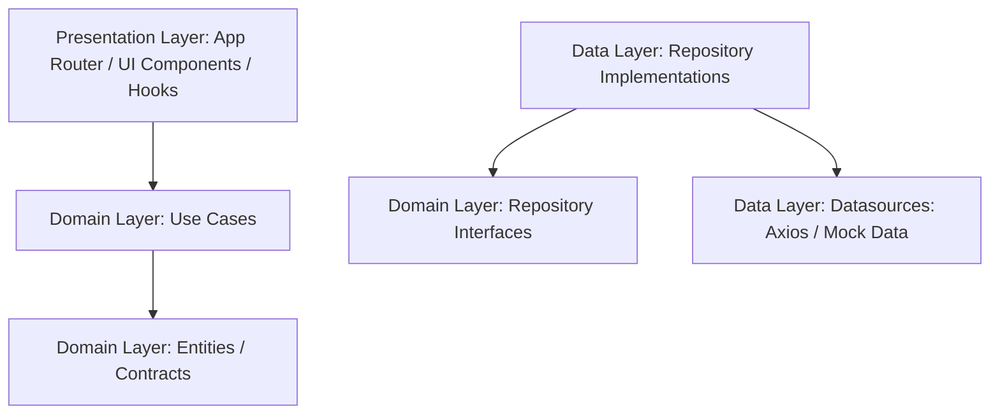

# Clean Architecture Audit & Refactoring Proposal

**Product:** Kopoin - Setiap Aksi Punya Nilai  
**Repository:** `D:\Koperasi-Point\client`  
**Target:** Restructure frontend to align with Senior Software Engineering principles (separation of concerns, domain-driven boundary, and testability).

---

## 1. Executive Summary & Core Concept

Clean Architecture splits the codebase into distinct layers that separate core business rules from infrastructure details (like UI components, state managers, and network libraries). 

For the Next.js frontend of **Kopoin**, we propose a layout that preserves the app router framework while cleanly delineating three core layers:



---

## 2. Proposed Folder Structure

We organize our business domain directly at the root level of the client folder:

```text
client/
├── app/                        # Presentation: Next.js pages & routing (App Router)
├── components/                 # Presentation: Shared UI & layout components (with ui/, admin/, auth/)
├── hooks/                      # Presentation: Custom React hooks (useScroll, useMobile, etc.)
├── lib/                        # General utilities and API client configuration (api.ts, utils.ts)
│
├── domain/                     # CORE BUSINESS DOMAIN LAYER (Zero external dependencies)
│   ├── entities/               # Business entities (campaign.ts, user.ts, activity.ts, etc.)
│   ├── repositories/           # Repository contracts/interfaces (auth.repository.ts, etc.)
│   └── usecases/               # Individual, testable business actions (login.usecase.ts, etc.)
│
└── data/                       # INFRASTRUCTURE & DATA LAYER
    ├── models/                 # DTO mappings & JSON serializers
    └── repositories/           # Concrete implementations of domain repository interfaces
```

---

## 3. Layer Breakdown & Implementation Plan

### 3.1 Domain Layer (Contracts & Entities)
This layer contains the core rules of Kopoin. It knows nothing about Axios, LocalStorage, or React hooks.
*   **Entities:** Convert interfaces inside `kopoinAdminMockData.ts` to distinct file entities under `domain/entities/`:
    *   `domain/entities/campaign.ts` (contains `CampaignData`)
    *   `domain/entities/team.ts` (contains `TeamLeaderboardEntry`)
    *   `domain/entities/activity.ts` (contains `RecentActivity`)
    *   `domain/entities/user.ts` (contains `User` properties from Auth)
*   **Repository Contracts:**
    *   `domain/repositories/auth.repository.ts` defines registration/login signatures.
    *   `domain/repositories/campaign.repository.ts` defines campaign data retrieval contracts.

### 3.2 Data Layer (Implementation & Services)
Implements the contracts defined in the Domain layer and acts as the gatekeeper to APIs or Local Mock files.
*   **Repository Implementations:** 
    *   Create `data/repositories/auth.repository.impl.ts` which implements `AuthRepository` calling the API client.

### 3.3 Presentation Layer (Next.js Pages & Custom Hooks)
Consumes Use Cases through React state or hooks.
*   The current `app/` and `components/` folders act as the UI templates.
*   We can refactor hooks (like `useAuthForm`) to execute specific use cases (e.g. `LoginUseCase(authRepository)`) rather than direct axios configuration.

---

## 4. Refactoring Step-by-Step

To prevent code regression and ensure we do not break any visual states on the admin console, the transition will be executed incrementally:

1.  **Stage 1: Folder Allocation**
    *   Create `domain/entities/`, `domain/repositories/`, `domain/usecases/`.
    *   Create `data/repositories/`.
2.  **Stage 2: Domain Setup**
    *   Create entity and repository interfaces.
3.  **Stage 3: Data Implementation**
    *   Initialize repository concrete classes.
4.  **Stage 4: Presentation Linkage**
    *   Reconnect `useAuthForm` hook and page controllers to use the new Use Cases.
    *   Verify Next.js build compilation with `tsc --noEmit`.

---

## 5. Decision Logging & Commit Plan

Each refactoring commit will be marked with a dedicated audit ID in `WORK_LOG.md` under **P1 (Refactor)**.

> [!NOTE]
> Proceeding with this refactoring will isolate business logic from UI, enabling the senior developer to write unit tests on Use Cases independently of the browser environment.
